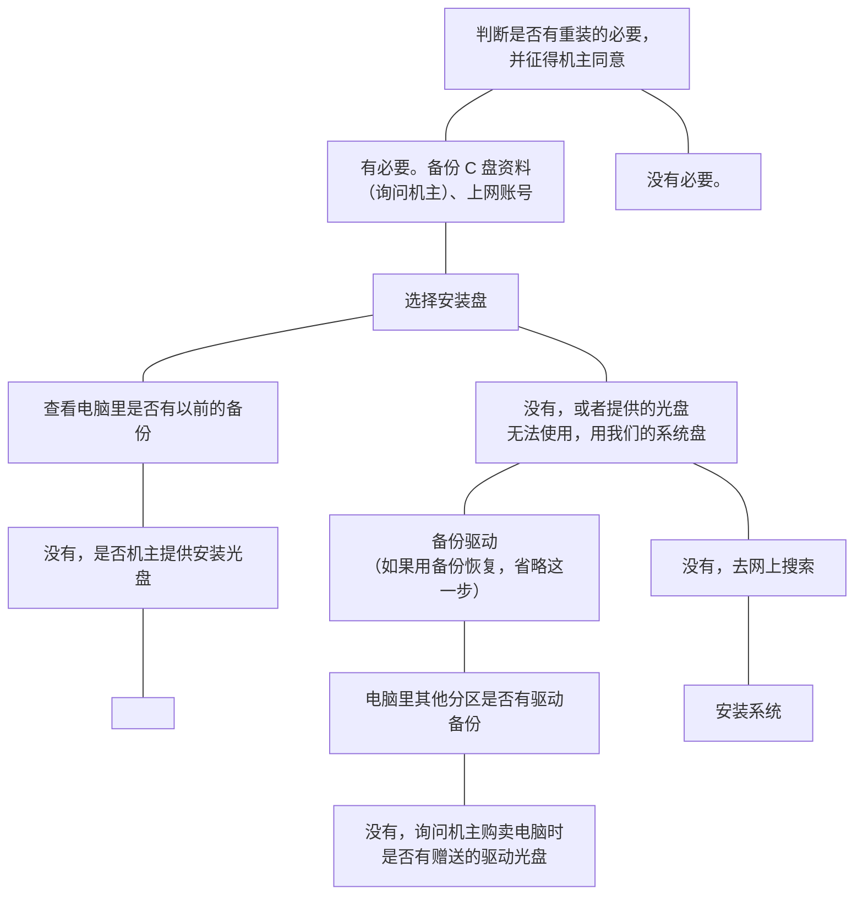

# 维修注意事项

做好每次任务的记录，以备再次出现问题时查询。记录内容：队伍人员、日期时间、机主姓、联系电话、问题描述（机主的描述、我们到现场后了解的情况）、处理方法、机主签字。

只处理软件问题，遇到并判断为硬件问题，告诉机主，去找专业维修人员，我们作为志愿者，无法承担打开机箱后万一对其他硬件造成损害的责任。

保证机主的资料安全。

多与机主沟通，多了解些情况。

对一些涉及密码的软件（QQ、股票交易软件、银行软件等），告知机主自行安装。如果机主不会，要在机主在场监督的情况下，在软件官方网站下载、安装。

尽量不重装系统，在没有办法解决的情况下再重装。

如果重装系统，重装前要备份好 C 盘资料、上网账号、找好驱动（首先考虑使用购机时附带驱动盘，如果没有去其他分区内查看是否有驱动备份，再没有就去网上搜集，不考虑使用驱动精灵备份）。原则上不考虑使用我们的系统盘，查看以前是否有进行过备份，如有就恢复以前的备份（有的机器会备份在 C 盘以外的分区，有的机器会用隐藏分区备份），或者买电脑时有提供系统恢复光盘（如果是机主自己购买的系统盘，看磨损状况，情况太差再使用我们的系统盘）。重装完系统后，安装必要软件，打系统补丁，清理垃圾文件，如果以前没有备份，备份，并告知机主已经备份。

杀毒默认装瑞星，影音播放默认装暴风影音，office 默认装 2003（补丁和 2007 兼容包），优化软件根据机主需求装，默认不装。

出现软件光盘里没有的软件，去 `www.skycn.com` 或者 `www.duote.com` 下载。

处理完后，简要告知机主问题所在以及处理方法、结果和注意事项。

## 附录：软件光盘内容

```text
360.exe
KIS.SCH.MSI
RAV2008.EXE
IE7_Setup.exe
Thunder5.8.2.515.exe
KLP352-YLMF.EXE
Kmplayer.exe
kugou.exe
PPSYLMFSYSTEM.EXE
QvodSetup.exe
RealPlayer11.exe
Storm3_192.exe
VistaCodecs.exe
UUSEE.exe
ttplayersetup.exe
Microsoft Office 2007 简体中文四合一精简版.exe
Microsoft Office Word、Excel 和 PowerPoint 2007 文件格式兼容包 3.exe
MULTIPROCESSOR_UPDATE.EXE
OFFICE2003.EXE
office2003-KB943985-v2-FullFile-CHS.exe
PHOTOSHOP_CS3.EXE
sogou_pinyin_33.exe
Theme_2_YlmF.exe
ULTRAISO.EXE
Vista一键还原.exe
Vista优化大师.exe
Windows Live Messenger.msi
Windows优化大师.exe
WINRAR.EXE
WPS2007.11260.0.EXE
YLMF_ONEKEY1.5.EXE
傲游maxthon.exe
超级兔子.exe
光影魔术手.exe
一键备份DOS版.exe
```

## 重装与否的判断流程



〔原件此处是一张用 Word 图形画的流程图，共 13 个圆角方框与 12 条连接线。上图的方框文字与**连接关系**取自原文件本身（各连接线记录了它两端各连哪个框），照原样重绘；连线两端的箭头朝向没有存进文件，各框的坐标也没有，因此上图一律画成不带箭头的连线，图形排布与原件不同。其中一个方框在原件里就是空的。〕

1. 判断是否有重装的必要，并征得机主同意
   - 没有必要。
   - 有必要。备份 C 盘资料（询问机主）、上网账号
2. 备份驱动（如果用备份恢复，省略这一步）
   - 电脑里其他分区是否有驱动备份
   - 没有，询问机主购卖电脑时是否有赠送的驱动光盘
   - 没有，去网上搜索
3. 选择安装盘
   - 查看电脑里是否有以前的备份
   - 没有，是否机主提供安装光盘
   - 没有，或者提供的光盘无法使用，用我们的系统盘
4. 安装系统

〔“购卖”为原件笔误，照录未改。〕

## 整理说明

〔这是目前档案里最早的一份有明确年份的维修工作守则。另一份[维修队队规](/archived/2009/repair-team-code-of-conduct)（原件名“八大纪律八项注意”）与它多有重合，但那份原件没有日期，只能定到 2008–2010 之间，两者孰先孰后判不了。

第二条“**只处理软件问题**”是协会维修至今仍在守的那条线。这里是它现存最早的成文出处，也是唯一一处给了理由的——不是嫌硬件麻烦，是“我们作为志愿者，无法承担打开机箱后万一对其他硬件造成损害的责任”。同一条规矩后来一路传到[维修日的现场](/repair/repair-day)与[维修指南](/repair/guide)，中间隔了十几年。

守则里最具体的几条，今天读起来仍然成立：涉及密码的软件让机主自己装、装不了就在机主看着的情况下从官网装；能不重装就不重装；重装前先找机主自己的驱动盘和恢复分区，实在没有才用协会的系统盘。这些都不是技术问题，是**边界问题**——志愿者能碰什么、不能碰什么。

那张软件光盘清单则是另一回事：它把 2008 年一台中国大学生的电脑完整地封存了下来。瑞星与卡巴斯基（KIS）、暴风影音与 KMPlayer、迅雷 5、QVOD、PPS、酷狗、UUSee、傲游浏览器、超级兔子、Windows 优化大师、光影魔术手、搜狗拼音，以及四处出现的 YLMF——雨林木风。清单里同时装着 Office 2003 与 2007 的文件格式兼容包，两代格式当时正在换代。

记录格式那一条（人员、时间、机主、联系电话、问题描述、处理方法、签字）几乎逐项落在同期的[维修单](/archived/2008/on-site-repair-report)上，也是今天[在线工单](https://nbtca.space/repair)里那几个字段的雏形。〕
