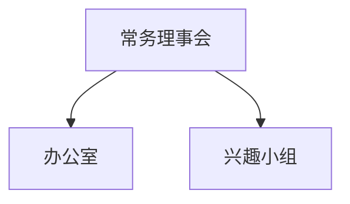

# 计算机协会内部调整计划 V2.0

组成：理事会、办公室、兴趣小组

〔原件此处是一张用 Word 图形画的结构图：三个文本框与两条连接线，竖线自“常务理事会”向下带箭头，横线在其下方接住“办公室”与“兴趣小组”。上图按原件各形状的坐标重绘，层级与连接方向照原样，样式不同。〕

## 急需解决的问题

- 协会章程（什么事 > 怎么做 > 找什么人）
- 协会发展的最终目标是什么？
- 协会核心竞争力是什么？如何建立核心竞争力？
- 会员积极性问题
- 协会资源积累

## 导言

同学之所以愿意成为会员，首先是因为计算机知识，所以计算机技术是我们的特色，应打造成为核心竞争力。策划组织活动等内容各协会都有，包括学生会之类的组织，所以不是我们的特色。针对以上特点，协会内部结构有必要调整，应当有适应于协会特点不可复制的内部结构和管理方式 。

在理工，协会是一个外部管理宽松的组织，规则基本可以由管理者自由制定，在自我要求严格时，这是个有益因素。在外部因素不容易改变的情况下，成为一个优秀的社团，协会首先要从内部管理上领先于其他组织。这主要依赖于一个好的管理制度以及一个努力的管理团队。

协会接下来的活动都将尝试以团队的方式进行，由团队完成一项具体的操作内容，形成团队统一的管理 。

## 部门职能

常务理事会：协会的中枢部门，决策层，人员一般包括正副会长、主任、小组组长，以及其他有志于管理好协会的会员。管理协会日常事务（包括内部建设，对外交流访问，处理和审核活动，订立规章制度，协调各部门运作，向上级汇报工作等），并对各种紧急情况作出安排。

办公室：协会的资料中心，执行层，负责整理归档协会文件，向理事会报告协会动向，协会人员管理，经费审核和管理，处理会员申请，以及对外发布各类协会消息等，是具体协会计划的执行者。同时，作为会员进入理事会的考察部门，考察期内，希望进入理事会的会员需要在办公室工作一段时间。

兴趣小组：由协会内部对特定几个方面比较感兴趣的同学组成，各小组应有组长一名，组员若干，以团队形式存在。该组织为协会日后重点发展对象，为协会日后的技术实力打下基础，组员在一定兴趣的基础上，需要严格按照小组纪律活动。各小组在享有特定方面知识的培训和统一学习机会的同时，还需要担负起与兴趣相关活动的组织工作（包括制作活动策划、活动海报、经费预算、场地申请、人员安排等）。但该部门的自由度较大：除了以协会的小组结构存在并遵守协会统一的制度以外，其余事务都可交由内部打理，若需要，兴趣小组的名称也可以重新设计（默认：XX兴趣小组），可以独立招收新成员（需要向办公室申请并通过审核），亦可以有组内独立合法收入。日常活动交由小组组长安排，一学期至少需要组织一次以上的活动（内外皆可），其余活动随时可向办公室提出举办请求。有活动安排必须事先通知办公室。常规支出则可向办公室申请经费。（简言之：大协会内的小协会，但可以利用协会的一些资源，像资金，人员等）。

## 各部门存在的意义

常务理事会：一种压力自上而下分解的主张，考虑到以往协会主要事务由一两个人承担，这种方式不仅造成个人压力过大，并且可能会因为个人的判断失误或懒惰而对协会造成重大损失，也使协会的日常工作透明度不够高，难以发挥一些希望参与到协会管理工作中的会员发挥作用。所以，这是一种不健康，不可持续的方式。相对合理的方式应以机构的方式进行，所有成员受到机构统一的约束和安排，将协会权利分解，使压力均匀分配。亦可提高协会的决策水平和管理质量，为协会后续发展打下基础。

办公室：工作虽然繁琐，但考虑到文件等资料的集中性，以及工作较为琐碎，不宜分散到个人管理。办公室仍需设立，并且办公室在协会中具有不可代替的作用，决策之后，具体事务需要由具体部门去安排落实。理想的办公室应该把协会的内部资料和内部制度完善工作做好，使协会的大小事务都有清晰明了的安排。其工作难度较大，同时可作为会员进入理事会前锻炼和考察的机构。

兴趣小组：学生会、社联等组织有个矛盾的地方，既希望组织学术性活动，但又不具备相应学术技能，这种硬伤间接断送了这类组织主办一个高质量学术性活动的可能性。现在这种问题也出现在了本协会，作为计算机知识的普及者，我们没有相应的能力去实现我们的普及宗旨。专业性较强的活动其他人员又无法接入，最终形成混乱局面。

一方面，这主要体现在技术实力上的不足，同时，这种不足使得我们协会在外边失去了自信和核心竞争力。可以说，没有技术的计算机协会谈不上一个真正意义上的计算机协会。

另一方面，在最近几个学期的观察中发现，协会内不少同学渴望学习知识以及得到一个相应的交流环境，但我们并没有做好衔接工作，使得优秀会员大量流失。所以，接下来的工作应当以调动会员积极性为首要工作目标进行。

在协会事务方面，过去的活动部、宣传部等组织早已厌倦当前重复性工作，同时又没有可行的新方案，长此以往，部门工作积极性降低，任务难以按预期完成，为协会造成了负面影响。另外，这类部门在工作中并未形成专业技能，也没有带来显著的工作水平上的提高。于是决定撤销这类部门。将事务分解到兴趣小组，交由兴趣小组完成相应活动的相应工作。

1. 丰富兴趣小组的学习内容
2. 分解压力
3. 改善活动质量

## 其他

## 致管理者

在有限的时间范围内，我们没有足够的时间为协会从无到有，摸索出一套相对完善的管理方案，而实际上在管理上已经有不少前人做了总结。作为管理者应当积极补充管理知识，尝试将一些好的管理方法在协会推广，在协会的管理实践中提高管理水平。尝试引进新的管理模式，以解决目前管理中出现的问题，正视协会发展中存在的各种问题，并提出意见，积极发起团队讨论。

最后，希望所有在理事会的队友们都能贡献自己的一份力量，希望所有的人都可以尽快完成从被安排到积极为协会出谋划策的角色转变，这样大家才能逐渐建立起一种相互信赖的关系。只有完美的团队，没有完美的个人。既然在理事会就说明理事会需要你的力量，大家共同努力才可以创造一个强大的计算机协会。

## 工作努力方向

明确职能，完善制度，目标制定及分解，提高管理水平

## 会员分级制度：（拟）

协会尝试设立会员分级制度，根据对协会贡献度的不同给予不同的福利待遇。

## 常务理事会详细

理想团队人数：（待定）

理事会考核指定：（待定）

实行例会制度，每周举行理事会例会

实行值周制度，每周由不同的队员负责一周事务，例会时进行工作总结和工作汇报。并且需要提出协会目前出现的问题，以及解决计划。

每次例会需要为协会制定切实可行的周计划。每轮值周完成后制定新一轮总计划。周计划通常按照每轮的总计划分解执行，特殊情况另作安排。每学期末理事会每位成员为下学期分别制定计划，并且开会确定最终计划。

## 2010 上半年计协理事会名单

| 姓名   | 班级     |
| ------ | -------- |
| 韩克   | 08计算机 |
| 李信   | 08通信   |
| 李济轩 | 09电气   |
| 许相元 | 09材化   |
| 陈晓泽 | 09能源   |
| 徐韵颖 | 08计算机 |
| 叶成怡 | 08通信   |
| 洪波   | 09机电   |
| 王帅   | 09能源   |
