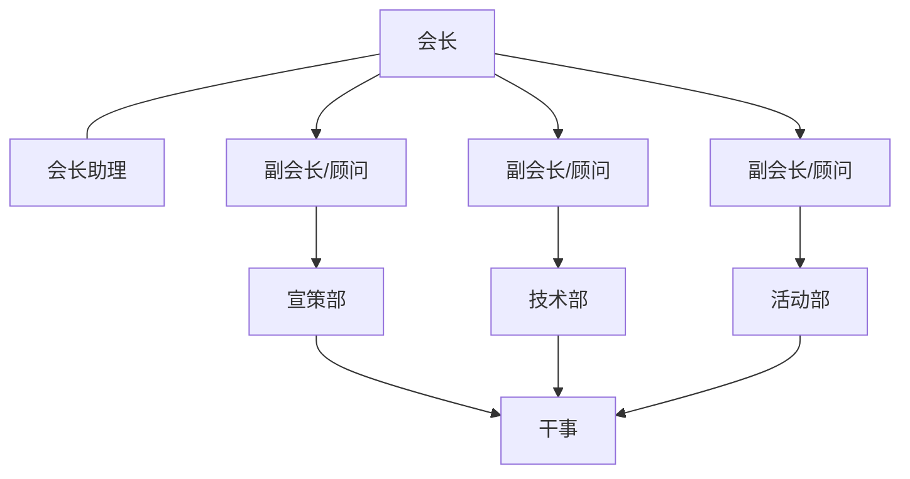

# 计算机协会 2014—2015 学年社团工作报告

## 目录

〔原件目录带页码，此处省略页码。〕

- 一、社团简介
- 二、成立宗旨
- 三、基本情况
  - 1、组织建设
  - 2、财务管理
  - 3、宣传管理
  - 4、活动流程
  - 5、社团成果
- 四、学年总结
- 五、发展规划
- 六、社员通讯录（附件一）
- 七、社团注册登记证书（附件二）

## 一、社团简介

计算机协会成立于 2002 年 3 月，成立 13 周年以来协会一直本着“联合广大计算机爱好者，普及计算机知识，提高计算机应用水平”的活动宗旨开展活动。协会部门经多次改革现分为三部门，活动部、技术部、宣策部。

作为信息学院学生社团组织的领头羊，协会响应学院号召，积极配合学生会、社联的工作安排，协会也一直以来得到学院领导的支持与肯定，在他们的帮助下开展了很多的活动，如理工服务日、程序设计大赛、计算机知识竞赛、电子产品导购与维护讲座、GSM 电路焊接、日常维修等。协会将向着多元化的方向，越来越好地发展。

## 二、成立宗旨

联合广大计算机爱好者，普及计算机知识，提高计算机应用水平。

## 三、基本情况

### 1）组织建设

与上学年相比，计算机协会对部门进行了调整，由原先的五个部门调整为现在的三个部门。将宣传部改为宣策部，将维修技术部、移动智能及硬件发烧友之家、软件技术部合并为技术部，保留了活动部。经过部门调整，协会的办事效率更高，社员的选择也更加明确。另外，本学年为各部门增加了顾问一职，任职者都是协会里面的老成员，可以将部门经验很好的传给新任部长，以便于部门更好更快的发展。

〔原件此处是一张用 Word 图形画的结构图，上图按其框与箭头重绘。原图上会长只有一条箭头向下、接在中间那位副会长的位置，两侧两位副会长的框没有画线连回会长；三位副会长的框文字完全相同，都写“副会长/顾问”。会长助理是一条横向箭头指入会长下方那条竖线。〕

**会长**：

1. 负责协会工作的开展。
2. 定期召开工作例会，传达学院相关部门对协会工作的指导，讨论制定本学期工作计划和工作重点。
3. 主动向分院相关部门汇报工作情况和申请工作指示。
4. 及时了解和关心协会各理事的思想工作，学习和生活，调动他们的积极性，主动协调各方面关系。
5. 维护协会的集体利益。
6. 监督协会的使用情况，代表协会签署有关文件。
7. 加强协会的自身队伍素质的建设，组织协会各部门负责人进行理论学习和实践指导。
8. 组织完成上级下达的工作任务。
9. 对外寻求交流、赞助，加强与其他校内学生组织的交流，对内注重内建。

**会长助理**：

1. 主要负责整理、收集和协会工作的各种资料，收集学生对社团各部门的各种意见，以及总结活动后的小结和学期工作计划。
2. 负责协会财务收支管理工作，并定期向社员汇报。（协会经费的取得，应及时记入帐本。做到经费的使用应合理、节约，如超出规定限额须先行报审。协会所购买的实物，应明确使用方向，并定期核对。正确核算协会的各项活动的费用支出及节余。）
3. 定期公布财务状况，以便接受广大社员监督。
4. 作好协会会议和学校有关会议的记录工作。

**副会长**：

1. 协助会长展开工作，会长不在时，代理会长工作。
2. 负责草拟协会有关文件。
3. 讨论、制定工作计划和工作重点。
4. 深入开展调查研究，熟悉协会的内部工作。
5. 指导监督各部门工作，组织完成上级下达的工作任务。
6. 协助理事主持协会全面工作，协调各部门关系。
7. 处理协会日常事务。
8. 审批，负责协会内大小活动的校内公关（审批活动、申请场地、学分小票等）。
9. 与理事会共同协商新的研究方案。

**宣传部**：

1. 大力开展各种宣传活动，及时做好各种海报，宣传栏目，提高协会各方面的知名度。（宣传分为前期的活动宣传，主要宣传手段为海报、横幅、喷绘、宣传单、微信公众号、微博等，后期宣传手段包括活动成果展，网上宣传等）
2. 负责活动过程中照片的拍摄和收集，并制作活动成果展等宣传方式，并把照片交于会长助理保管。
3. 负责协会在不同时期的宣传工作，加强宣传的规范性和全面性。
4. 定期召开协会宣传部会议，传达协会的工作指导思想，加强部门成员的联系。
5. 定期总结宣传部工作经验，并根据协会在今后工作设想提出宣传部工作初步计划与征求意见。
6. 负责活动过程中所需的 PPT 的制作，及小型宣传片的制作。

**技术部**：

1. 为协会活动开展提供技术支持。
2. 负责协会为学院提供的无偿维修活动。
3. 协会品牌活动理工服务日的技术以及工具提供人员。
4. 定期开展和组织维修相关会内活动，促进会内和谐与团结。

〔正文这一节标题写“三部门”，而职责逐条列的是会长、会长助理、副会长、宣传部、技术部——活动部与宣策部的职责原件未列。〕

### 2）财务管理

协会建立有严格的管理制度，做到财务公开、真实、准确、透明。

1. 一切公共财产归协会所有，任何单位，个人不得侵占，私分和挪用，不得随意在会员中分配。
2. 本协会经费主要来源协会会员所交纳的会费，具体活动经费向上级申请或由外联组等筹集经费。
3. 活动经费的开销由各部提交书面申请，会长助理审核批准，会长签字后生效。活动完毕后该组须将活动各项开销票据上交会长助理核对保管。协会内部的财政收支情况，会长助理须定期向财务汇报，并自觉接受全体会员的监督。
4. 每学期的财务在下学期的会员大会上通报，接受全体会员的监督。

### 3）宣传管理

宣传发面由宣传部执行，活动部进行监督，以确保高质量高效的完成社团宣传需要。

1. 多方面的宣传合作，协会内部分工明确
2. 宣传策划方案需上交理事会进行商讨
3. 宣传资料由社团统一保管，汇总
4. 宣传的方式主动及时、规范合理

### 4）活动流程

1. 提前一个月计划好下个月要举办的活动，活动部统计并写好活动汇总表、活动审批表，举办活动部门写一份策划和社团活动经费预算表经副会和顾问审核后交给活动部，由活动部交活动汇总表、活动审批表和策划给社联活动部和办公室，交社团活动经费预算表给社联办公室，等待审批。
2. 活动前期活动部确定审批通过，宣策部开始制作海报、宣传单、条幅等，并通过微博、贴吧等渠道进行宣传，有必要的话联系校内外媒体对活动进行关注。
3. 活动部向社联确认场地的审批以及学分小票的审批，并联系举办活动的部门购买活动所需的相关物品。
4. 活动部在举办活动前一天通知社联监督部和宣传部活动的时间和地点。
5. 举办活动部门负责活动的顺利开展，宣策部负责活动现场的拍照。
6. 活动结束后，宣策部整理活动现场照片，活动部负责整理活动现场。
7. 有经费支出的部门向会助报销，会助统计并填好社团活动经费结算表交给活动部。
8. 举办活动部门填写社团活动评估表交给活动部。
9. 活动部把两份表格交给社联监督部。
10. 活动负责人写好活动总结并交给社联监督部。
11. 举办活动部门收集所有关于这次活动的材料（包括表格、策划、照片、海报、宣传单等），上传到协会的网盘（格式及表格参看 2014 年度，电子产品导购与维修讲座 20140420）。

### 5）社团成果

| 日期       | 活动                                             |
| ---------- | ------------------------------------------------ |
| 2014.10.12 | 协会纳新前活动，负责电脑清灰、软件及系统安装     |
| 2014.10.15 | 露天广场纳新，展示协会成员自己制作的电子产品     |
| 2014.10.24 | 召开社团动员大会，介绍社团及接下来的活动安排     |
| 2014.10.30 | 部分成员代表协会参加高校社团联合会               |
| 2014.11.02 | 协会内部装系统教学活动                           |
| 2014.11.22 | 协会成员自主报名参加了 2014 环甬骑行活动         |
| 2014.11.30 | 协会内部制作网线教学活动                         |
| 2014.12.08 | 面对全校的第七届计算机知识竞赛，并且评出各项奖项 |
| 2014.12.28 | 协会和无线电联合举办电路焊接活动                 |
| 2015.03.05 | 雷锋日在石麟大楼提供电脑咨询服务                 |
| 2015.03.12 | 邀请在校老成员，庆祝协会成立 13 周年聚餐活动     |
| 2015.04.02 | 社团大会对财务情况说明以及介绍活动安排           |
| 2015.04    | 光立方教学活动                                   |
| 2015.05.15 | 协会品牌活动---理工服务日，露天广场免费电脑维修  |
| 2015.05.16 | 参观宁波三合电子科技公司，与公司老总交流经验     |
| 2015.06    | 协会换届，确定 14 届成员                         |
| 2015.07    | 计算机协会暑期社会实践活动                       |

## 四、学年总结

回顾这一学年，计算机协会策划并且举办了很多具有学术性，又不失趣味的活动。总的来说，这一学年协会在原先的基础上有了更好的发展。

在原先对外活动的基础上，这学年增加安排了几次对内的教学活动，重点加强协会内部的建设。因为上学年的不足之处就在于忽略了社团内部的建设，没有有效的发挥新社员对协会建设的作用，而只在于提高了他们参与活动的积极性。所以结合实际情况，本学年的对内教学活动起到了很好的内建作用，涌现了一大批新社员参与到协会的建设当中，提出了很多很好的建议，为协会的发展起到了很有效的作用。

本学年协会的活动对各负责人提出了更高的要求，对他们的专业知识有了很大的考验。焊接教学、装系统教学、制作网线教学、光立方教学等教学活动，是对各负责人的一大考验。可喜的是，活动的各负责人都交出了满意的答卷。虽然有些活动他们也是第一次接触，但是他们提前准备，认真学习，为活动的顺利开展做足功课。看到协会成员的快速成长，看到各部长对大型的活动也能够独挡一面，协会的未来真的是充满希望。

除了校园的一些活动，社员们还参加了很多校外的活动，比如参加了高校社团联合会、2014 环甬骑行、参观宁波三合电子科技公司等活动。这极大促进了社团成员之间的交流和感情，增加了社员的归属感，让他们感觉到计算机协会带给他们的幸福与喜悦。

通过这些活动，我希望社员们在学习到知识的同时能够培养起他们处理事情的能力，能够面对困难，能够有所担当。从而使协会能够更优秀更长久的发展下去。

## 五、发展规划

计算机协会举办再多的活动也不能忘其成立的宗旨——联合广大计算机爱好者，普及计算机知识，提高计算机应用水平。计算机协会终归是一个学术科技类社团，以发展学术为主。

不同于其它的社团，计算机协会对专业知识要求较高，很多新生在社团纳新的时候听到计算机协会就会望而却步。因此，社团内成员大多是本专业为主，这对社团多元化的发展有了很大的限制性。从成员构成的角度来说，过于单一，即使有几个别的学院学生加入到协会，不多久就会发现自己和身边的社员在专业上没有可以交流的话题，因而逐渐失去参加活动的热情。从成员的知识水平来说，过于缺乏，很多成员都是无基础、无概念。计算机知识广而杂，在协会一年的学习很难发展成为有领导能力的社员，因而对协会换届是一个极大的考验，对协会的发展也有很大的影响。一个社团的能力高低，往往取决于社团的领导人，而发现一个有能力的领导人是一件可遇而不可求的事情。以上两点是计算机协会也可以说是其它很多社团目前共同遇到的发展瓶颈。

针对以上问题，希望协会以后的发展能够更加注重社员的结构，多开展新的活动吸引其它学院的人才，并形成一种文化。另外，注重协会人才的挖掘与培养，这将有利于协会的长久发展。协会的未来应该是面向更广阔的世界，吸收和培养更具特色的人才，创造和发扬更具活力的社团文化。未来是属于年轻人的，社团的梦也将由你们实现。

## 附件一：计算机协会会长团、部长团、指导老师通讯录

〔原附件含手机长号、校内短号与学号，此处只保留姓名、职务与班级，职务名称照原件。原件分“协会会长团名单”与“协会各部门部长名单”两张表，此处按原样分列。名单末尾另附“2014-2015 学年新成员名单汇总”，整份为姓名、班级、学号与联系方式，未收录。〕

### 协会会长团名单

| 职务                     | 姓名   | 班级     |
| ------------------------ | ------ | -------- |
| 协会会长                 | 诸葛瞻 | 电信 122 |
| 会长助理                 | 邵佳培 | 金融 123 |
| 协会顾问（宣策部）       | 陈浙锋 | 电信 122 |
| 协会顾问（活动部）       | 徐成峰 | 通信 121 |
| 协会顾问（技术部）       | 胡谢杰 | 机制 124 |
| 协会副会长（主管宣策部） | 项晨晨 | 电信 122 |
| 协会副会长（主管活动部） | 谢智勇 | 通信 121 |
| 协会副会长（主管技术部） | 陈聪   | 电信 121 |

### 协会各部门部长名单

| 职务             | 姓名   | 班级       |
| ---------------- | ------ | ---------- |
| 协会活动部部长   | 章祺   | 信计 131   |
| 协会活动部副部长 | 丁佳妮 | 通信 131   |
| 协会活动部副部长 | 胡佳其 | 物流 133   |
| 协会宣策部部长   | 胡旭倩 | 通信 131   |
| 协会宣策部副部长 | 冯佩琳 | 通信 131   |
| 协会技术部部长   | 章丽姣 | 通信 131   |
| 协会技术部副部长 | 沈佳明 | 自动化 132 |
| 协会技术部副部长 | 朱可   | 自动化 131 |
| 协会技术部副部长 | 缪毛威 | 土木 134   |
| 协会技术部副部长 | 韦帅   | 土木 133   |

指导老师：王朗

〔这份名单与一年前的[第十三届换届公示](/archived/2014/13th-handover-result)对不上。会长团八人的姓名与班级两处完全一致，部长团却有六人的班级不同——且都是 13 级：

| 姓名           | 第十三届公示 | 本报告     |
| -------------- | ------------ | ---------- |
| 丁佳妮         | 电信 133     | 通信 131   |
| 冯佩琳         | 电信 133     | 通信 131   |
| 胡旭倩         | 电信 133     | 通信 131   |
| 章丽娇／章丽姣 | 电信 133     | 通信 131   |
| 朱可           | 电气 132     | 自动化 131 |
| 沈佳明         | 电气 134     | 自动化 132 |

两份都是协会自己出的材料，谁对判不了，此处照录本报告的写法。另有一处人员出入：公示里的技术部副部长**沈泰宁**（电气 131）没有出现在本报告的名单上。姓名写法的出入（章丽娇／章丽姣）见[组织与沿革](/about/organization)的说明。〕

## 整理说明

〔这份报告是理解协会部门沿革的一块关键拼图。

2013 年第十二届[换届公示](/archived/2013/12th-handover-result)时，协会是活动部、维修技术部、软件技术部、[移动智能与硬件发烧友之家](/archived/2013/zhijia-charter)加宣传部——五个部门。这份报告写明，2014—2015 学年把其中三个技术类部门**合并成了一个“技术部”**，宣传部改名宣策部，加上活动部，共三部。而 2018 年的[组织架构改革](/archived/2018/org-restructure-plan)所描述的“改革前”状态，又是系统部/软件部/硬件部/综合部/宣策部五个部门——也就是说，2015 年这次三合一后来又散开过。协会的部门数在十年里反复合分，这份报告是其中一次合的直接证据。

“顾问”这一职是这一年新设的，三个部门各一位，全部由上一届的老成员担任，目的写得很直白：“可以将部门经验很好的传给新任部长”。名单也印证了这一点——三位顾问陈浙锋、徐成峰、胡谢杰都是上一届的部长，其中徐成峰是[第十二届](/archived/2013/12th-handover-result)的软件技术部部长。会长诸葛瞻与副会长陈聪，则正是[2012 年那批技术记事](/archived/2012/tech-dept-writings)的作者——前者写越狱，后者写刻光盘。这是档案里最完整的一次“老带新”制度化尝试。

活动清单补上了好几件此前没有记录的事：2014 年 11 月 22 日成员自主参加环甬骑行；2015 年 3 月 12 日“邀请在校老成员，庆祝协会成立 13 周年聚餐”——协会为自己过生日的唯一一次记录，而 13 周年正与 2002 年 3 月这个成立日期吻合；2015 年 5 月 16 日参观宁波三合电子科技公司，此前只留下[一组照片](/about/organization)、连日期都定不了，这份清单把它补上了。3 月 5 日雷锋日在石麟大楼提供电脑咨询，则是[理工服务日](/concepts/service-day)之外另一条延续多年的服务线。

岗位职责与财务管理那两节是套用的模板：三年后的[《2017—2018 学年工作报告》](/archived/2018/2017-2018-work-report)里，会长、副会长、宣传部的职责条款与财务四条几乎逐字相同。真正随年份变化的是组织建设、活动清单与最后的发展规划三节，读的时候不妨直接看这几处。

那套十一步的活动流程，是校方与社联的报表制度在协会内部的完整投影：策划、审批表、经费预算表、学分小票、结算表、评估表、活动总结，一步不少。最后一条要求把所有材料上传网盘存档——正是因为有这条规矩，今天这批档案才存得下来。

最值得一读的是**发展规划那一节**。它没有说漂亮话，而是指出两个瓶颈：一是成员结构单一，外院学生进来后“发现自己和身边的社员在专业上没有可以交流的话题，因而逐渐失去参加活动的热情”；二是“在协会一年的学习很难发展成为有领导能力的社员，因而对协会换届是一个极大的考验”。第二条与 2014 年元旦[许益灵那封交班的信](/archived/2014/new-year-letter)里说的是同一件事——一年不够把人带出来。这个判断在此后每一次换届里都还成立。〕
