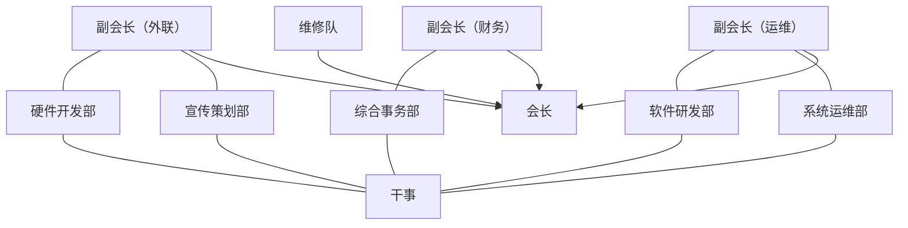

# 计算机协会 2017—2018 学年社团工作报告

## 一、社团简介

计算机协会成立于2002年3月，成立16周年以来协会一直本着“联合广大计算机爱好者，普及计算机知识，提高计算机应用水平”的活动宗旨开展活动。协会部门经多次改革现分为五部门，由综合事务部、硬件开发部、软件研发部、系统运维部、宣传策划部组成。

作为数据、信息学院学生社团组织的领头羊，协会响应学院号召，积极配合学生会、社联的工作安排，协会也一直以来得到学院领导的支持与肯定，在他们的帮助下开展了很多有意义的活动，如理工电脑维修服务日、计算机知识竞赛、电子产品知识科普风暴、网线制作教学、网页设计大赛等。协会将通力合作，努力成为浙大宁波理工学院的一流社团！

## 二、成立宗旨

联合广大计算机爱好者，普及计算机知识，提高计算机应用水平。

## 三、基本情况

### 1）组织建设

与上学年相比，计算机协会对部门进行了调整，由原先的三个部门细化为现在的五个部门。将组织部升级成为宣策部，将原软件细分为了系统运维部和软件开发部，设立了综合事务部，继续保留硬件部。经过部门调整，协会的办事效率更高，社员的选择也更加明确。另外，本学年为进一步强化会长统筹全局的功能，取消了原先的会长顾问，由各部门负责人直接向对应的副会长负责，并将原先的维修队独立出来，直接由会长负责。所有的任职者都是协会里面的老成员，可以将部门经验很好的传给新任部长，以便于部门更好更快的发展。

〔原件此处是一张用 Word 图形画的结构图，上图按其框与箭头重绘。原图的箭头一律由下向上指，即副会长与维修队都指向会长；维修队画在会长右侧、与三位副会长不同层，正对应正文所说“将原先的维修队独立出来，直接由会长负责”。〕

#### 会长

1. 负责协会工作的开展。
2. 定期召开工作例会，传达学院相关部门对协会工作的指导，讨论制定本学期工作计划和工作重点。
3. 主动向分院相关部门汇报工作情况和申请工作指示。
4. 及时了解和关心协会各理事的思想工作，学习和生活，调动他们的积极性，主动协调各方面关系。
5. 维护协会的集体利益。
6. 监督协会的使用情况，代表协会签署有关文件。
7. 加强协会的自身队伍素质的建设，组织协会各部门负责人进行理论学习和实践指导。
8. 组织完成上级下达的工作任务。

#### 副会长（财务）

1. 负责协会财务收支管理工作，并定期向社员汇报。（协会经费的取得，应及时记入账本。做到经费的使用应合理、节约，如超出规定限额须先行报审。协会所购买的实物，应明确使用方向，并定期核对。正确核算协会的各项活动的费用支出及节余。）
2. 定期公布财务状况，以便接受广大社员监督。
3. 作好协会会议和学校有关会议的记录工作。
4. 负责监督综合事务部相关工作

#### 副会长（运维）

1. 协助会长展开工作，会长不在时，代理会长工作。
2. 负责草拟协会有关文件。
3. 讨论、制定工作计划和工作重点。
4. 深入开展调查研究，熟悉协会的内部工作。
5. 指导监督各部门工作，组织完成上级下达的工作任务。
6. 负责监督系统运维部、软件研发部相关工作

#### 副会长（外联）

1. 审批，负责协会内大小活动的校内公关（审批活动、申请场地、学分小票等）。
2. 对外寻求交流、赞助，加强与其他校内学生组织的交流。
3. 负责整理、收集和协会工作的各种资料，收集学生对社团各部门的各种意见，以及总结活动后的小结和学期工作计划。
4. 负责监督宣传策划部相关工作，定期检查微信公众号、微博等对外宣传平台的内容

#### 宣传策划部

1. 大力开展各种宣传活动，及时做好各种海报，宣传栏目，提高协会各方面的知名度。（宣传分为前期的活动宣传，主要宣传手段为海报、横幅、喷绘、宣传单、微信公众号、微博等，后期宣传手段包括活动成果展，网上宣传等）
2. 负责活动过程中照片的拍摄和收集，并制作活动成果展等宣传方式，并把照片交于会长助理保管。
3. 负责协会在不同时期的宣传工作，加强宣传的规范性和全面性。
4. 定期总结宣传部工作经验，并根据协会在今后工作设想提出宣传部工作初步计划与征求意见。
5. 负责活动过程中所需的PPT的制作，及小型宣传片的制作。

#### 维修队

为协会活动开展提供技术支持。

负责协会为学院提供的无偿维修活动。

协会品牌活动理工服务日的技术以及工具提供人员。

定期开展和组织维修相关会内活动，促进会内和谐与团结。

#### 软件研发部

制作一些协会用日常软件，如计算机知识竞赛的考试平台。

教一些编程语言与常用软件。

构想软件方面的新奇创意，并予以实践。

#### 硬件开发部

1. 研究一些符合时代潮流的新奇硬件如VR技术、红外技术等，并定期内部讨论
2. 负责开发好玩有趣的硬件设备，如光立方等
3. 与维修队一起负责主持理工服务日，并提供人员

#### 系统运维部

对外代表计算机协会参加各类竞赛活动

负责协会各类平台的运维，并就服务器等问题与学校进行沟通合作

组织负责网页设计大赛

#### 综合事务部

定期召开协会内部会议，传达协会的工作指导思想，加强各部门成员的联系。

协助会长进行协会的日常管理，负责记录协会所有例会的内容

直接负责历年计算机知识竞赛的开展

### 2）财务管理

协会建立有严格的管理制度，做到财务公开、真实、准确、透明。

一切公共财产归协会所有，任何单位，个人不得侵占，私分和挪用，不得随意在会员中分配。

本协会经费主要来源为数据学院拨给经费以及前年协会成员上交的会费，具体活动经费向上级申请或由宣策部等筹集经费。

活动经费的开销由各部提交书面申请，会长助理审核批准，会长签字后生效。活动完毕后该组须将活动各项开销票据上交副会长核对保管。协会内部的财政收支情况，会长助理须定期向财务汇报，并自觉接受全体会员的监督。

每学期的财务在下学期的会员大会上通报，接受全体会员的监督。

### 3）宣传管理

宣传方面由宣策部执行，副会长（外联）进行监督，以确保高质量高效的完成社团宣传需要。

1. 多方面的宣传合作，协会内部分工明确
2. 宣传策划方案需上交会长团进行商讨
3. 宣传资料由社团统一保管，汇总
4. 宣传的方式主动及时、规范合理

### 4）活动流程

提前一个月计划好下个月要举办的活动，综合事务部统计并写好活动汇总表、活动审批表，举办活动部门写一份策划和社团活动经费预算表经副会长和会长审核后，由会长交活动汇总表、活动审批表和策划给社联活动部和办公室，交社团活动经费预算表给社联办公室，等待审批。

活动前期活动部确定审批通过，宣策部开始制作海报、宣传单、条幅等，并通过微博、微信公众号等渠道进行宣传，有必要的话联系校内外媒体对活动进行关注。

综合事务部向社联确认场地的审批以及学分小票的审批，并联系举办活动的部门购买活动所需的相关物品。

组织举办活动前三天通知社联督导和宣传部活动的时间和地点。

举办活动的部门负责活动的顺利开展，宣策部负责活动现场的拍照。

活动结束后，宣策部整理活动现场照片，综合事务部负责整理活动现场。

有经费支出的部门向副会长（财务）报销，统计并填好社团活动经费结算表交给社联。

举办活动部门填写社团活动评估表交给综合事务部。

综合部把两份表格交给会长，由会长交给社联监督部。

活动的负责人写好活动总结并交给会长，会长整理后交给社联监督部。

举办活动部门收集所有关于这次活动的材料（包括表格、策划、照片、海报、宣传单等），**上传到协会的网盘**。

### 5）社团成果

| 日期       | 活动                                                                              |
| ---------- | --------------------------------------------------------------------------------- |
| 2017.07    | 计算机协会“心为宁波服务行，行伴科技文化心”暑期社会实践活动                        |
| 2017.10.15 | 露天广场百团大战纳新，展示协会成员自己制作的产品                                  |
| 2017.10.23 | 召开计算机协会动员大会，介绍社团及接下来的活动安排                                |
| 2017.10.31 | 计算机协会开展[文明上网宣传活动](/archived/2017/net-civility-campaign)            |
| 2017.12.04 | 第一次露天广场电脑维修服务日                                                      |
| 2017.12.08 | 举办[第十届计算机知识竞赛](/archived/2017/10th-knowledge-contest)，并评出各类奖项 |
| 2017.12.28 | [智慧数据科技行之手机知识科普风暴](/archived/2017/phone-knowledge-storm)          |
| 2018.03.23 | [第二次露天广场电脑维修服务日](/archived/2018/service-day-2018)                   |
| 2018.04.23 | 部分社员参加并出席宁波市计算机学会浙江大学宁波理工学院成立大会                    |
| 2018.04.26 | [智慧数据科技行之网线制作教学](/archived/2018/cable-making-workshop)              |
| 2018.05.12 | 计算机协会内部举行系统重装教学活动                                                |
| 2018.05.23 | 智慧数据科技行之成果展示暨第三次露天广场电脑维修服务日                            |

〔原表为纯文本的日期加活动名，此处排成表格，并把已收录的几项链到对应页面。表上 10 月 31 日一条原文另有一句政策表述，略去，其余照录。

几处日期与别的材料对不上：知识竞赛这里记 12.08，当天的[新闻稿](/archived/2017/10th-knowledge-contest)写 12 月 6 日；手机科普风暴这里记 12.28，[策划](/archived/2017/phone-knowledge-storm)定的是 12 月 27 日、新闻稿写的是 12 月 17 日；网线制作这里记 04.26，[新闻稿](/archived/2018/cable-making-workshop)写 4 月 25 日。都并列保留，不代为裁定。〕

## 四、学年总结

回顾这一学年，计算机协会策划并且举办了很多具有学术性，又不失趣味的活动。总的来说，这一学年协会在原先的基础上有了更好的发展。

在原先对外活动的基础上，这学年增加安排了几次对内的教学活动，重点加强协会内部的建设。因为上学年的不足之处就在于不够重视社团内部的建设，没有有效的发挥新社员对协会建设的作用，而只在提高他们参与活动的积极性。所以结合实际情况，本学年的对内教学活动频率和质量都有所改变，起到了很好的内建作用，涌现了一大批新社员参与到协会的建设当中，例如首次出现了大一同学担任副部长这一职务，他们提出了很多很好的建议，为协会的发展起到了很有效的作用。

本学年协会的活动对各负责人提出了更高的要求，对他们的专业知识有了很大的考验。装系统教学、制作网线教学、计算机知识竞赛、手机知识科普风暴等教学活动，是对各负责人的一大考验。可喜的是，活动的各负责人都交出了满意的答卷。虽然有些活动他们也是第一次接触，但是他们提前准备，认真学习，为活动的顺利开展做足功课。看到协会成员的快速成长，看到各部长对大型的活动也能够独挡一面，协会的未来充满希望。

除了对内的一些活动，社员们还参加了很多对外的活动，比如协会绝大多数成员都加入了宁波市计算机学会浙大宁波理工分部并出席成立大会，这极大促进了社团成员之间的交流和感情，增加了社员的归属感，让他们感觉到计算机协会带给他们的荣誉。

通过这些活动，希望社员们在学习到知识的同时能够培养起他们处理事情的能力，能够面对困难，能够有所担当。从而使协会能够更优秀更长久的发展下去。

## 五、发展规划

计算机协会举办再多的活动也不能忘其成立的宗旨——联合广大计算机爱好者，普及计算机知识，提高计算机应用水平。计算机协会终归是一个学术科技类社团，以发展学术为主。

不同于其它的社团，计算机协会对专业知识要求较高，很多新生在社团纳新的时候听到计算机协会就会望而却步。因此，社团内成员大多是本专业为主，这对社团多元化的发展有了很大的限制性。从成员构成的角度来说，过于单一，即使有几个别的学院学生加入到协会，不多久就会发现自己和身边的社员在专业上没有可以交流的话题，因而逐渐失去参加活动的热情。从成员的知识水平来说，过于缺乏，很多成员都是无基础、无概念。计算机知识广而杂，在协会一年的学习很难发展成为有领导能力的社员，因而对协会换届是一个极大的考验，对协会的发展也有很大的影响。一个社团的能力高低，往往取决于社团的领导人，而发现一个有能力的领导人是一件可遇而不可求的事情。以上两点是计算机协会也可以说是其它很多社团目前共同遇到的发展瓶颈。

针对以上问题，希望协会以后的发展能够更加注重社员的结构，多开展新的活动吸引其它学院的人才，并形成一种文化。另外，注重协会人才的挖掘与培养，这将有利于协会的长久发展。协会的未来应该是面向更广阔的世界，吸收和培养更具特色的人才，创造和发扬更具活力的社团文化。

## 六、社员通讯录（附件）

〔原件附有一张干部与指导老师通讯录，逐人记有职位、姓名、班级、负责部门、电话与短号。按本站的[脱敏原则](/archived/index)整表不予收录。该学年的职务与人名见[聘书名单](/archived/2017/appointment-letters)。〕

---

〔这份报告是 2015 年之后档案里最完整的一次组织自述，有三处值得单独记下。

一、五部门是这一学年成型的。由三部门细化为五部门：组织部升级为宣策部，软件部拆成系统运维部与软件研发部，新设综合事务部，硬件部保留。同时取消会长顾问，改由各部长直接对口副会长；维修队独立出来，直接由会长负责。三位副会长按财务、运维、外联分工。次年的[组织架构改革方案](/archived/2018/org-restructure-plan)是在这个底子上继续改的。

二、活动流程写成了一条完整的链。提前一个月立项 → 三张表报社联 → 宣策部起宣传 → 综合部办场地与学分 → 办活动 → 报销、评估、总结逐级上交 → “收集所有关于这次活动的材料……**上传到协会的网盘**”。今天这个档案袋里之所以有这么多成套的策划、经费表、签到表与照片，正是这条流程的产物。

三、发展规划那一节没有说漂亮话。“很多新生在社团纳新的时候听到计算机协会就会望而却步”——这句话 [2013 年的工作报告](/archived/2013/2012-2013-annual-report)已经写过一次：“很多新生都看到协会的名称而却步了，他们一直以为协会是很专业的”。相隔五年，同一个问题被两任会长分别写下。〕
