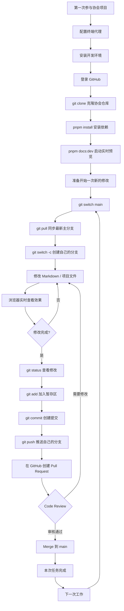

# 2026.09.05 编写文档和git协作指导会议

:::info 会议信息

- 地点：线上腾讯会议
- 时间：Sep 5 20:00 - Sep 5 20:45 CST 2026
- 记录员：[sheepkinn](https://github.com/sheepkinn)

:::

〔 本文是会议内容的基础上，结合实践中遇到的问题总结所得 〕

[[toc]]

## 1. 配置终端网络

在安装 Homebrew、Scoop、Git、Node.js，或者克隆 GitHub 仓库之前，建议先确认终端能够正常访问 GitHub。

很多时候会出现：

```text
浏览器可以正常访问 GitHub
            ≠
终端可以正常访问 GitHub
```

因为浏览器可能已经经过代理软件，而 Terminal、PowerShell、Git、curl、Homebrew 等命令行程序仍然可能尝试直连。

所以建议先解决终端网络，再安装后面的开发环境。

### 1.1 macOS：使用 Shadowrocket

macOS 推荐使用 Shadowrocket。

先打开 Shadowrocket，并连接一个可用节点。

然后进入：

```text
设置
↓
代理
↓
代理共享
↓
启用共享
```

打开：

```text
启用共享
```

开启以后，在这个页面中可以看到 Shadowrocket 提供的代理端口。

例如：

```text
SOCKS5：1082
```

或者其他端口。

这里的 `1082` 只是示例，实际使用时请以自己 Shadowrocket 中显示的端口为准。

对于当前这台 Mac，本地代理地址一般可以写成：

```text
127.0.0.1:端口
```

例如：

```text
127.0.0.1:1082
```

可以先测试 SOCKS5 是否可用：

```bash
curl --socks5-hostname 127.0.0.1:1082 -I https://github.com
```

如果能够快速出现：

```text
HTTP/2 200
```

或者其他正常 HTTP 响应，就说明 Shadowrocket 代理工作正常。

#### 临时让 Terminal 走 Shadowrocket

执行：

```bash
export ALL_PROXY=socks5h://127.0.0.1:1082
export all_proxy=socks5h://127.0.0.1:1082
```

检查：

```bash
echo $ALL_PROXY
```

应该看到：

```text
socks5h://127.0.0.1:1082
```

然后测试：

```bash
curl -I https://github.com
```

还可以测试 Git：

```bash
git ls-remote https://github.com/nbtca/documents.git HEAD
```

如果能够快速返回一串 Commit Hash 和：

```text
HEAD
```

说明 Git 也可以正常访问 GitHub。

这种方式只对当前 Terminal 窗口生效。

关闭 Terminal 之后，一般就会失效。

#### 永久配置 Shadowrocket

macOS 默认一般使用 zsh。

打开：

```bash
nano ~/.zshrc
```

加入：

```bash
export ALL_PROXY=socks5h://127.0.0.1:1082
export all_proxy=socks5h://127.0.0.1:1082
```

保存以后：

```bash
source ~/.zshrc
```

之后每次打开 Terminal 都会自动加载代理。

但是这种方式有一个缺点：

如果 Shadowrocket 没有运行，而 Terminal 仍然试图连接：

```text
127.0.0.1:1082
```

那么 Git、curl、Homebrew 等程序可能无法联网。

所以更推荐使用手动开关。

#### 推荐：配置 proxyon 和 proxyoff

编辑：

```bash
nano ~/.zshrc
```

加入：

```bash
alias proxyon='export ALL_PROXY=socks5h://127.0.0.1:1082; export all_proxy=socks5h://127.0.0.1:1082'

alias proxyoff='unset ALL_PROXY; unset all_proxy; unset http_proxy; unset https_proxy; unset HTTP_PROXY; unset HTTPS_PROXY'
```

保存后执行：

```bash
source ~/.zshrc
```

以后需要代理：

```bash
proxyon
```

关闭代理：

```bash
proxyoff
```

整个使用流程就变成：

```text
打开 Shadowrocket
↓
连接节点
↓
设置
↓
代理
↓
代理共享
↓
启用共享
↓
Terminal 输入 proxyon
↓
开始使用 Git / Homebrew / npm / pnpm
```

完成以后：

```bash
proxyoff
```

即可恢复终端直连。

如果 Shadowrocket 显示的端口不是 `1082`，请把上面所有 `1082` 替换成自己的实际端口。

---

### 1.2 Windows：使用 Clash Verge Rev

Windows 推荐使用 Clash Verge Rev。

打开 Clash Verge Rev 后：

1. 导入自己的订阅
2. 选择一个可用节点
3. 开启 System Proxy 或 TUN
4. 查看 Mixed Port

例如：

```text
Mixed Port: 7897
```

那么代理地址就是：

```text
127.0.0.1:7897
```

PowerShell 中临时设置：

```powershell
$env:http_proxy="http://127.0.0.1:7897"
$env:https_proxy="http://127.0.0.1:7897"
$env:HTTP_PROXY="http://127.0.0.1:7897"
$env:HTTPS_PROXY="http://127.0.0.1:7897"
```

检查：

```powershell
$env:http_proxy
```

测试：

```powershell
curl.exe -I https://github.com
```

如果能够快速返回正常 HTTP 响应，就说明代理已经生效。

永久配置：

```powershell
[Environment]::SetEnvironmentVariable("http_proxy", "http://127.0.0.1:7897", "User")
[Environment]::SetEnvironmentVariable("https_proxy", "http://127.0.0.1:7897", "User")
[Environment]::SetEnvironmentVariable("HTTP_PROXY", "http://127.0.0.1:7897", "User")
[Environment]::SetEnvironmentVariable("HTTPS_PROXY", "http://127.0.0.1:7897", "User")
```

取消：

```powershell
[Environment]::SetEnvironmentVariable("http_proxy", $null, "User")
[Environment]::SetEnvironmentVariable("https_proxy", $null, "User")
[Environment]::SetEnvironmentVariable("HTTP_PROXY", $null, "User")
[Environment]::SetEnvironmentVariable("HTTPS_PROXY", $null, "User")
```

如果只是偶尔需要终端代理，更推荐临时配置。

---

## 2. 安装开发环境

网络配置完成以后，再开始安装开发工具。

本文默认使用：

```text
macOS   → Homebrew
Windows → Scoop
```

包管理器可以理解为：

```text
不用自己去网站下载安装包
↓
直接在终端输入安装命令
↓
自动下载、安装和更新软件
```

### 2.1 macOS：安装 Homebrew

执行：

```bash
/bin/bash -c "$(curl -fsSL https://raw.githubusercontent.com/Homebrew/install/HEAD/install.sh)"
```

如果安装过程中出现：

```text
Press RETURN/ENTER to continue
```

按 Enter 即可。

安装完成后会看到类似：

```text
Installation successful!
```

Apple Silicon Mac 的 Homebrew 一般安装在：

```text
/opt/homebrew
```

随后根据 Homebrew 给出的提示将它加入 PATH。

通常类似：

```bash
echo 'eval "$(/opt/homebrew/bin/brew shellenv zsh)"' >> ~/.zprofile
eval "$(/opt/homebrew/bin/brew shellenv zsh)"
```

检查：

```bash
brew --version
```

如果能够显示版本号，就说明安装成功。

---

### 2.2 Windows：安装 Scoop

打开 PowerShell。

首先执行：

```powershell
Set-ExecutionPolicy -ExecutionPolicy RemoteSigned -Scope CurrentUser
```

然后安装 Scoop：

```powershell
Invoke-RestMethod -Uri https://get.scoop.sh | Invoke-Expression
```

检查：

```powershell
scoop --version
```

以后就可以通过：

```powershell
scoop install 软件名
```

安装开发工具。

---

### 2.3 安装 Git 和 GitHub CLI

macOS：

```bash
brew install git gh
```

Windows：

```powershell
scoop install git
scoop install gh
```

检查：

```bash
git --version
gh --version
```

其中：

```text
git
```

负责版本管理。

```text
gh
```

是 GitHub 官方命令行工具。

---

### 2.4 配置 Git 并登录 GitHub

配置 Git 用户名：

```bash
git config --global user.name "你的 GitHub 用户名"
```

配置邮箱：

```bash
git config --global user.email "你的 GitHub 邮箱"
```

查看：

```bash
git config --global --list
```

这些信息用于记录 Commit 作者。

它并不代表已经登录 GitHub。

登录 GitHub：

```bash
gh auth login
```

一般选择：

```text
GitHub.com
HTTPS
Login with a web browser
```

然后按照终端提示，在浏览器中完成授权。

检查：

```bash
gh auth status
```

---

### 2.5 安装 Node.js、npm 和 pnpm

Node.js 是协会文档项目运行 VitePress 所需要的 JavaScript 环境。

安装 Node.js 后会自动附带 npm。

macOS：

```bash
brew install node
```

Windows：

```powershell
scoop install nodejs-lts
```

检查：

```bash
node -v
npm -v
```

然后安装 pnpm：

```bash
npm install -g pnpm
```

如果项目明确指定 pnpm 版本，例如：

```text
pnpm 9.0.0
```

则：

```bash
npm install -g pnpm@9.0.0
```

检查：

```bash
pnpm -v
```

具体 Node.js 和 pnpm 版本应该优先按照项目仓库中的：

```text
.nvmrc
package.json
pnpm-lock.yaml
```

进行配置。

---

## 3. 常用终端命令

参与协会项目并不需要提前学习完整套 Linux 命令。

下面这些基本命令已经能够满足大部分需求。

### 3.1 目录操作

查看当前所在位置：

```bash
pwd
```

查看当前目录：

```bash
ls
```

进入文件夹：

```bash
cd documents
```

返回上一层：

```bash
cd ..
```

返回用户主目录：

```bash
cd ~
```

创建文件夹：

```bash
mkdir test
```

创建多层目录：

```bash
mkdir -p ~/Developer/nbtca
```

---

### 3.2 文件操作

创建文件：

```bash
touch test.md
```

移动文件：

```bash
mv test.md docs/
```

重命名：

```bash
mv old.md new.md
```

删除文件：

```bash
rm test.md
```

删除目录：

```bash
rm -r test
```

`rm` 删除的文件通常不能直接撤回，因此使用之前注意检查路径。

macOS 使用 Finder 打开当前目录：

```bash
open .
```

Windows：

```powershell
explorer .
```

---

## 4. 克隆协会项目并实时预览

环境准备完成以后，就可以开始使用协会项目。

协会文档仓库：

```text
https://github.com/nbtca/documents
```

### 4.1 第一次 Clone 仓库

首先创建一个用于存放项目的文件夹：

```bash
mkdir -p ~/Developer
cd ~/Developer
```

克隆仓库：

```bash
git clone https://github.com/nbtca/documents.git
```

也可以使用 GitHub CLI：

```bash
gh repo clone nbtca/documents
```

进入项目：

```bash
cd documents
```

`git clone` 可以理解为：

```text
GitHub 上的仓库
↓
git clone
↓
完整复制到自己的电脑
```

Clone 一般只需要第一次执行。

以后项目已经存在本地以后，不需要重复 Clone。

---

### 4.2 安装项目依赖

第一次 Clone 以后：

```bash
pnpm install --frozen-lockfile
```

简单理解：

```text
package.json
↓
项目需要哪些依赖

pnpm-lock.yaml
↓
这些依赖具体使用哪个版本

pnpm install
↓
下载安装到本地
```

依赖没有变化时，一般不需要每次重新安装。

---

### 4.3 启动实时预览

执行：

```bash
pnpm docs:dev
```

随后终端一般会显示类似：

```text
http://localhost:5173/
```

在浏览器中打开即可。

之后修改 Markdown 文件：

```text
修改文件
↓
保存
↓
VitePress 自动检测变化
↓
浏览器实时更新
```

因此平时写文档时推荐同时打开：

```text
编辑器
+
Terminal
+
浏览器
```

Terminal 中保持：

```bash
pnpm docs:dev
```

持续运行即可。

---

### 4.4 dev、build 和 preview

开发：

```bash
pnpm docs:dev
```

用于：

```text
边修改
边查看
```

正式构建：

```bash
pnpm docs:build
```

可以理解成：

```text
Markdown / Vue / CSS
↓
build
↓
最终网站
```

预览正式构建：

```bash
pnpm docs:preview
```

简单记：

| 命令 | 用途 |
| --- | --- |
| `pnpm docs:dev` | 开发时实时查看 |
| `pnpm docs:build` | 构建正式网站 |
| `pnpm docs:preview` | 检查正式构建结果 |

平时修改文档主要使用：

```bash
pnpm docs:dev
```

---

## 5. Git 多人协作

第一次 Clone 完成以后，后面的日常工作主要围绕 Git 分支进行。

完整流程如下：



这里最需要区分的是：

```text
git clone
```

和：

```text
git pull
```

`git clone`：

> 第一次把整个 GitHub 仓库下载到自己的电脑。

`git pull`：

> 已经有项目以后，把其他成员最新的修改同步到自己的电脑。

---

### 5.1 开始修改前先同步 main

进入项目：

```bash
cd ~/Developer/documents
```

切换到主分支：

```bash
git switch main
```

同步最新代码：

```bash
git pull
```

因为在你上一次工作之后，其他成员可能已经修改了仓库。

所以每次开始新任务前，最好先同步一次 main。

---

### 5.2 创建自己的工作分支

不要直接在 `main` 上完成日常修改。

创建自己的分支：

```bash
git switch -c 分支名
```

例如：

```bash
git switch -c docs/git-guide
```

查看当前分支：

```bash
git branch
```

可能显示：

```text
* docs/git-guide
  main
```

`*` 表示当前所在分支。

可以简单理解成：

```text
                 docs/git-guide
                /
main ──────────●
                \
                 其他成员的分支
```

每个人先在自己的分支上完成修改。

修改完成以后，再通过 Pull Request 合并进入 main。

---

### 5.3 修改文件并实时查看

创建分支以后，可以直接开始修改 Markdown。

同时运行：

```bash
pnpm docs:dev
```

浏览器中就可以实时看到效果。

随时可以执行：

```bash
git status
```

查看哪些文件发生了变化。

---

### 5.4 Add 和 Commit

修改完成以后：

```bash
git status
```

加入指定文件：

```bash
git add 文件名
```

例如：

```bash
git add tutorial/git.md
```

也可以把当前所有修改加入：

```bash
git add .
```

然后创建 Commit：

```bash
git commit -m "docs: add git collaboration guide"
```

整个过程可以理解为：

```text
修改文件
↓
工作区

git add
↓
暂存区

git commit
↓
Git 提交历史
```

Commit 可以理解为一个带说明的版本记录。

例如：

```text
commit A
添加 Git 教程框架

commit B
补充 macOS 环境配置

commit C
增加 Git 协作流程图
```

---

### 5.5 Push 到 GitHub

Commit 此时仍然只存在自己的电脑里。

第一次推送新分支：

```bash
git push -u origin docs/git-guide
```

以后：

```bash
git push
```

可以理解成：

```text
本地分支
↓
git push
↓
GitHub 上的远程分支
```

注意：

Push 完成以后，修改仍然没有进入 main。

---

### 5.6 Pull Request、Review 和 Merge

Push 完成以后，在 GitHub 创建 Pull Request。

Pull Request 简称：

```text
PR
```

可以理解为：

> 我的分支已经修改完成，请大家检查，如果没有问题就合并到 main。

其他成员可以在 PR 中：

- 查看修改内容
- 评论
- 提出修改建议
- Approve
- Merge

如果 Review 要求继续修改，不需要重新创建 PR。

继续在原来的分支修改：

```bash
git add .
git commit -m "docs: fix review comments"
git push
```

原来的 Pull Request 会自动更新。

审核通过以后，将分支 Merge 到：

```text
main
```

本次任务就完成了。

下一次继续：

```bash
git switch main
git pull
git switch -c 新分支
```

进入下一轮。

真正需要记住的日常协作流程就是：

```text
main
↓
pull
↓
创建分支
↓
修改
↓
add
↓
commit
↓
push
↓
Pull Request
↓
Review
↓
Merge
↓
回到 main
↓
pull
```

---

## 6. Markdown 常用功能

协会文档主要使用 Markdown 编写。

### 6.1 标题和目录

标题：

```md
# 一级标题

## 二级标题

### 三级标题
```

VitePress 中可以使用：

```md
[[toc]]
```

自动生成当前页面目录。

例如：

```md
[[toc]]

## 1. 环境配置

## 2. 克隆项目

## 3. Git 协作
```

---

### 6.2 代码块

Bash：

````md
```bash
git pull
```
````

PowerShell：

````md
```powershell
scoop install git
```
````

---

### 6.3 Mermaid 流程图

例如：

````md

````

对于流程、项目结构、协作方式等内容，Mermaid 通常会比纯文字更加直观。

---

### 6.4 更多markdown命令

参考菜鸟教程的[markdown教程](https://www.runoob.com/markdown/md-tutorial.html)

---

## 7. 常用命令和问题排查

### 7.1 Terminal 常用命令

| 命令 | 作用 |
| --- | --- |
| `pwd` | 查看当前位置 |
| `ls` | 查看当前目录 |
| `cd` | 切换目录 |
| `mkdir` | 创建文件夹 |
| `touch` | 创建文件 |
| `mv` | 移动 / 重命名 |
| `rm` | 删除 |
| `open .` | macOS 打开当前目录 |
| `explorer .` | Windows 打开当前目录 |

### 7.2 Git 常用命令

| 命令 | 作用 |
| --- | --- |
| `git clone` | 第一次下载仓库 |
| `git pull` | 同步远程最新修改 |
| `git status` | 查看修改状态 |
| `git branch` | 查看分支 |
| `git switch` | 切换分支 |
| `git switch -c` | 创建并切换分支 |
| `git add` | 加入暂存区 |
| `git commit` | 创建提交 |
| `git push` | 推送到 GitHub |
| `git log` | 查看提交历史 |

### 7.3 pnpm 常用命令

| 命令 | 作用 |
| --- | --- |
| `pnpm install --frozen-lockfile` | 安装项目依赖 |
| `pnpm docs:dev` | 启动实时开发预览 |
| `pnpm docs:build` | 构建正式网站 |
| `pnpm docs:preview` | 预览正式版本 |

### 7.4 macOS 无法访问 GitHub

先确认 Shadowrocket：

```text
设置
↓
代理
↓
代理共享
↓
启用共享
```

然后确认代理端口。

测试：

```bash
curl --socks5-hostname 127.0.0.1:1082 -I https://github.com
```

如果这个可以正常访问，再：

```bash
proxyon
```

然后：

```bash
curl -I https://github.com
```

如果仍然不正常，检查：

```bash
echo $ALL_PROXY
```

### 7.5 更换代理软件后 Git 无法连接

检查是否曾经单独给 Git 设置过代理：

```bash
git config --global --get-regexp proxy
```

如果存在已经失效的旧地址，例如：

```text
socks5h://127.0.0.1:1082
```

可以清除：

```bash
git config --global --unset http.proxy
git config --global --unset https.proxy
git config --global --unset http.https://github.com.proxy
```

某一项不存在时出现提示可以忽略。

### 7.6 Node 或 pnpm 找不到

检查：

```bash
node -v
npm -v
pnpm -v
```

如果只有 pnpm 不存在：

```bash
npm install -g pnpm
```

如果项目指定版本，则安装对应版本。

---

## 8. 一次完整协作示例

第一次参与协会项目：

```bash
git clone https://github.com/nbtca/documents.git

cd documents

pnpm install --frozen-lockfile

pnpm docs:dev
```

以后开始一个新任务：

```bash
git switch main
git pull

git switch -c docs/本次任务

pnpm docs:dev
```

修改完成：

```bash
git status

git add .

git commit -m "docs: 描述本次修改"

git push -u origin docs/本次任务
```

随后：

```text
GitHub
↓
创建 Pull Request
↓
Code Review
↓
修改 / Approve
↓
Merge 到 main
```

## 附录

- 本次会议与会人员
  - [m1ngsama](https://github.com/m1ngsama)
  - [Egger0](https://github.com/Egger0)
  - [sheepkinn](https://github.com/sheepkinn)
  - [Yuna-Celisse](https://github.com/Yuna-Celisse)
  - [Orangedog433](https://github.com/Orangedog433)
