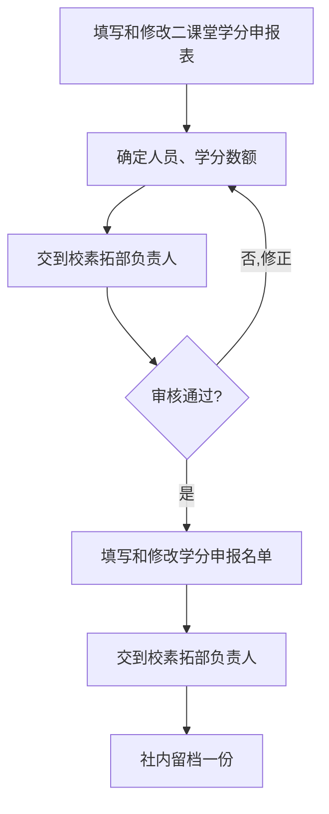

# 申请第二课堂学分

:::info 维护信息

| 维护人        | 时间      |
| ------------- | --------- |
| @ZaoAn0skiler | ??? - ??? |

:::

## 流程

```mermaid
graph TD
  A[填写和修改二课堂学分申报表] --> B[确定人员、学分数额]
  B --> C[交到校素拓部负责人]
  C --> D{审核通过?}
  D -- 否,修正 --> B
  D -- 是 --> E[填写和修改学分申报名单]
  E --> F[交到校素拓部负责人]
  F --> G[社内留档一份]
```
