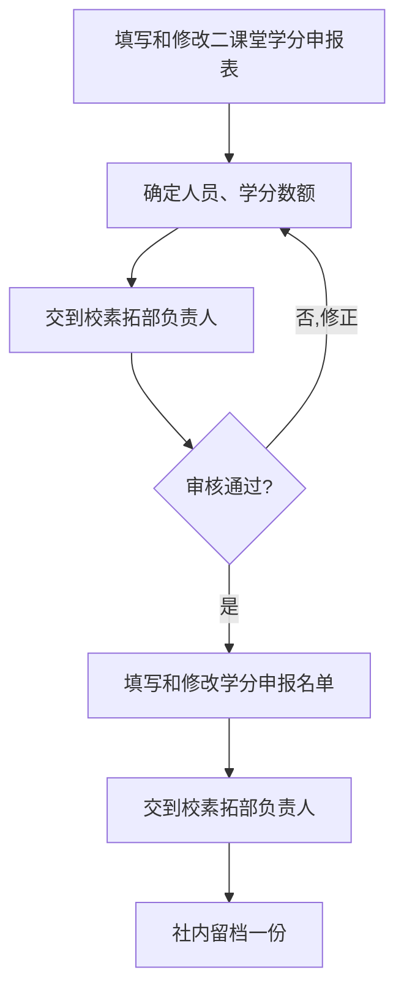

# 申请第二课堂学分

:::info 维护信息

| 维护人                                           | 时间      |
| ------------------------------------------------ | --------- |
| [@ZaoAn0skiler](https://github.com/ZaoAn0skiler) | ??? - ??? |

:::

[[toc]]

## 什么是第二课堂学分

第二课堂学分是高校在传统课堂教学（第一课堂）之外，对学生参与社团活动、志愿服务、学术讲座等课外实践进行认定的学分。学校通过"第二课堂成绩单"制度，将学生的课外活动纳入综合素质评价体系。

:::tip 为什么要关注第二课堂学分

- **毕业要求**：部分学校将第二课堂学分列为毕业必备条件，未修满将影响正常毕业。
- **综合测评**：第二课堂学分直接影响个人综合素质测评成绩，与评奖评优挂钩。
- **能力证明**：参与社团活动获得的学分记录，是展示个人综合能力的重要凭证。

:::

对于计算机协会而言，每次举办活动（如 CA101 讲座、维修日、网络安全讲座等）后，参与活动的同学均可申请相应的第二课堂学分。由负责人统一整理申报材料并提交审核。

## 院级与校级学分的区别

由于计算机协会是**院级社团**，申报流程会根据活动级别有所不同：

| 类型     | 对接部门 | 晚自修请假                 | 备注                     |
| -------- | -------- | -------------------------- | ------------------------ |
| 院级学分 | 社团部   | 晚自修可统一请假           | 直接找社团部转交申报材料 |
| 校级学分 | 素拓部   | 大一晚自修需要学生自行请假 | 找素拓部转交申报材料     |

:::warning 注意

申报表模板可能随学期更新而变动，每次申报前务必向素拓部或社团部确认是否有最新版本，**不要直接沿用上一次的旧模板**。

:::

## 流程

## 各步骤详解

### 第一步：填写和修改二课堂学分申报表

活动结束后，由负责人根据活动情况填写《第二课堂学分申报表》。申报表需要包含活动的基本信息，如活动名称、时间、地点、参与人数、活动内容概述等。

:::tip 建议

活动结束后尽快填写申报表，趁记忆清晰。建议在活动举办当天就完成初稿，避免拖延导致信息遗漏。

:::

### 第二步：确定人员、学分数额

根据签到记录核实实际参与人员名单，并按照学校标准确定每位参与者可获得的学分数额。现在基本没有纸质签到小票，通过**签到名单导入**的方式确认参与人员。

需要确认的内容包括：

- 参与人员的姓名、学号、学院等基本信息
- 每人对应的学分数额（根据活动类型和参与时长确定）
- 区分组织者与普通参与者（学分数额可能不同）

### 第三步：交到校素拓部负责人

将填写完成的申报表提交给对应部门的负责人进行初审。注意根据活动级别选择正确的提交对象：

- **院级活动** → 提交给**社团部**
- **校级活动** → 提交给**素拓部**

### 第四步：审核

素拓部/社团部负责人会对申报材料进行审核。如果材料有问题（如信息不完整、格式不规范、学分数额不合理等），会退回要求修改。

:::warning 常见退回原因

- 申报表信息与活动实际情况不符
- 参与人员名单中有学号或姓名错误
- 使用了旧版本的申报表模板
- 学分数额超出活动类型对应的标准

:::

### 第五步：填写和修改学分申报名单

审核通过后，根据最终确认的人员和学分数额填写正式的《学分申报名单》。该名单是最终录入系统的依据，务必仔细核对每一条信息。

### 第六步：提交学分申报名单

将最终的学分申报名单再次提交给素拓部/社团部负责人，由其录入系统。

### 第七步：社内留档

将本次申报的所有材料（申报表、人员名单、活动照片等）在社团内部保存一份备档。建议以电子文档形式存放在社团共享文件夹中，方便后续查阅和参考。

:::tip 留档建议

建议按照 `年份/活动名称/` 的目录结构存放档案材料，并在文件名中标注日期，例如 `2025.04_CA101讲座_学分申报表.xlsx`。

:::

## 所需材料清单

| 材料名称            | 格式要求                        | 备注                       |
| ------------------- | ------------------------------- | -------------------------- |
| 二课堂学分申报表    | 使用素拓部/社团部提供的最新模板 | 需包含活动基本信息         |
| 签到记录 / 参与名单 | Excel 表格                      | 包含姓名、学号、学院等信息 |
| 学分申报名单        | 使用素拓部/社团部提供的最新模板 | 审核通过后填写             |
| 活动照片            | 若干张                          | 用于留档和佐证             |
| 活动策划书（如有）  | 电子文档                        | 已提交过的策划书可作为参考 |

## 时间预期

| 步骤                   | 预计耗时     | 说明                        |
| ---------------------- | ------------ | --------------------------- |
| 填写申报表             | 1-2 天       | 活动结束后尽快完成          |
| 确定人员与学分         | 1-2 天       | 需核对签到记录              |
| 提交并等待初审         | 3-7 个工作日 | 视素拓部/社团部工作安排而定 |
| 修改退回材料（如有）   | 1-3 天       | 根据退回意见修改            |
| 填写并提交学分申报名单 | 1-2 天       | 审核通过后立即完成          |
| 学分录入系统           | 1-2 周       | 由素拓部/社团部统一操作     |

:::warning 注意时间节点

- 每学期末通常有申报截止日期，**务必提前了解并在截止日期前完成提交**。
- 如果错过截止日期，本学期的活动学分可能需要等到下学期才能申报，甚至无法补报。
- 建议在活动结束后**两周内**完成所有申报材料的提交。

:::

## 常见问题

### 一次活动可以申报多少学分？

学分数额由学校规定，不同类型的活动对应的学分标准不同。具体标准请咨询素拓部或社团部。

### 没有签到怎么办？

如果活动没有签到记录，将很难证明参与情况。**务必在每次活动中做好签到工作**，这是申报学分的基础。

### 申报被退回了怎么办？

按照退回意见逐条修改后重新提交即可。常见问题多为格式错误或信息不完整，仔细对照模板填写一般都能通过。

### 我是活动的组织者，学分和普通参与者一样吗？

组织者和普通参与者的学分数额可能不同，具体以学校当年的规定为准。填写名单时需要注明身份。

### 已毕业或已退社的同学还能申报吗？

一般以活动举办时的在籍状态为准。如果活动举办时该同学尚未毕业且确实参与了活动，通常可以申报。具体请咨询对应部门。
