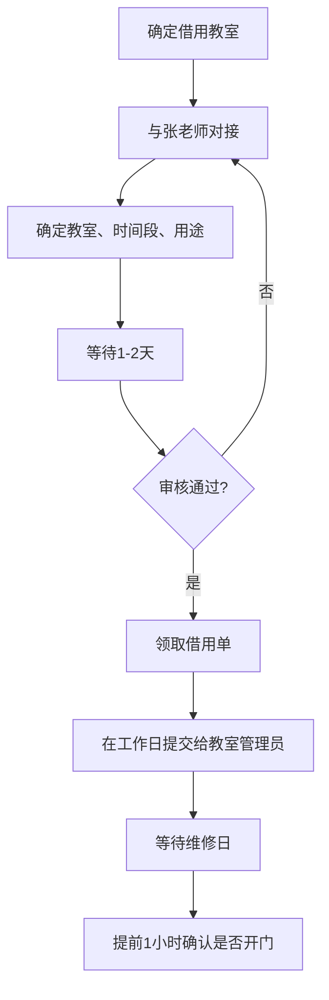

# 借教室

:::info 维护信息

| 维护人                                 | 时间      |
| -------------------------------------- | --------- |
| [@qyc1319](https://github.com/qyc1319) | ??? - ??? |

:::

[[toc]]

## 概述

计算机协会在举办各类活动时，通常需要向学校借用教室作为活动场地。常见的借用场景包括：

- **维修日**：为全校同学提供免费电脑维修服务，需要较大的教室或实验室
- **CA101 讲座**：电脑使用和维护知识普及讲座，需要配备投影设备的教室
- **网络安全讲座**：网络安全知识科普，需要多媒体教室
- **社团内部会议**：部门例会、培训等日常活动

:::tip 提前规划

借教室流程涉及多个审批环节，**建议至少提前一周开始申请**。如遇考试周或学校大型活动期间，教室资源紧张，需要更早规划。

:::

## 流程

## 各步骤详解

### 第一步：确定借用教室

根据活动的性质和预计参与人数，提前确定需要借用的教室。选择教室时需要考虑以下因素：

| 考虑因素 | 说明                                               |
| -------- | -------------------------------------------------- |
| 容纳人数 | 根据活动预计参与人数选择合适大小的教室             |
| 设备需求 | 是否需要投影仪、麦克风、白板等设备                 |
| 位置     | 尽量选择交通便利、方便同学到达的教学楼             |
| 电源插座 | 维修日需要较多电源插座，注意教室的插座数量和分布   |
| 桌椅布局 | 维修日可能需要重新排列桌椅，选择方便调整布局的教室 |

:::tip 选教室的经验

- 维修日建议选择底层教室，方便同学搬运电脑。
- 讲座类活动优先选择阶梯教室，视野好、容量大。
- 可以提前到候选教室实地查看一下条件是否满足需求。

:::

### 第二步：与张老师对接

确定好需求后，联系张老师进行对接。对接时需要准备好以下信息：

- 借用的具体教室编号（或备选方案）
- 借用的日期和时间段
- 活动的用途和简要说明
- 预计参与人数

:::warning 注意

- 与老师沟通时要礼貌、简洁、信息完整，**一次性说清楚需求**，避免反复询问。
- 如果不确定具体教室编号，可以提出需求（如"可容纳 50 人的多媒体教室"），由老师协助安排。

:::

### 第三步：确定教室、时间段、用途

与张老师沟通后，最终确认借用的教室编号、时间段和用途。这一步需要确保信息准确无误，因为后续的借用单将以此为依据。

### 第四步：等待审核（1-2 天）

提交借用申请后，需要等待 1-2 个工作日进行审核。审核期间学校会确认该时段教室是否有空、是否存在冲突等。

### 第五步：审核结果

- **审核通过**：进入下一步领取借用单。
- **审核未通过**：通常是因为教室在该时段已被占用或有其他安排。需要重新与张老师沟通，调整教室或时间后重新提交。

:::warning 审核不通过的常见原因

- 所选教室在该时段已有课程安排或被其他活动占用
- 借用时间与考试安排冲突
- 申请信息不完整或有误

:::

### 第六步：领取借用单

审核通过后，前往指定地点领取教室借用单。借用单是使用教室的正式凭证，务必妥善保管。

### 第七步：提交借用单给教室管理员

**在工作日**将借用单提交给对应教学楼的教室管理员。管理员确认后会在活动当天安排开门。

:::warning 重要

- **必须在工作日提交**，周末和节假日管理员可能不在。
- 建议至少在活动前**2-3 个工作日**提交，给管理员预留处理时间。
- 提交时确认管理员已知悉借用的具体时间和教室。

:::

### 第八步：活动当天

活动当天按计划前往教室。

### 第九步：提前 1 小时确认是否开门

在活动开始前 1 小时，安排人员前往教室确认是否已经开门。如果教室未开门，及时联系教室管理员处理。

:::tip 活动当天的注意事项

- 提前到达教室，检查设备（投影仪、空调、灯光等）是否正常。
- 如果需要调整桌椅布局，预留足够的布置时间。
- 活动结束后，**务必将教室恢复原状**（桌椅归位、清理垃圾、关闭电源和门窗），保持良好的借用记录有助于后续申请。

:::

## 所需准备材料

| 材料             | 说明                                 |
| ---------------- | ------------------------------------ |
| 活动策划书       | 部分情况下老师可能要求提供活动策划书 |
| 教室借用申请信息 | 教室编号、时间段、用途、参与人数     |
| 借用单           | 审核通过后领取，提交给教室管理员     |

## 时间预期

| 步骤               | 预计耗时            | 说明                       |
| ------------------ | ------------------- | -------------------------- |
| 确定需求并联系老师 | 1 天                | 提前明确需求可加快沟通效率 |
| 等待审核           | 1-2 个工作日        | 视学校行政安排而定         |
| 领取并提交借用单   | 1 天                | 需在工作日完成             |
| **整体流程**       | **约 3-5 个工作日** | 建议至少提前一周启动       |

:::warning 关键时间节点

- 考试周期间一般**不允许借用教室**，需要提前避开。
- 学校大型活动期间（如校运会、校庆等）教室资源紧张，需更早申请。
- 周末活动的借用单务必在**上一周的工作日内**提交给管理员。

:::

## 常见问题

### 可以同时借多间教室吗？

可以，但需要在申请时一并说明。多间教室的审核可能需要更长时间。

### 借用时间可以延长吗？

如果活动超时，原则上应按原定时间归还。如确实需要延长，应提前联系管理员沟通，不要未经同意擅自延时使用。

### 教室里的设备坏了怎么办？

使用前如发现设备故障，应立即联系管理员报修，**不要自行拆修教室设备**。使用过程中如因活动导致设备损坏，需如实报告。

### 活动取消了怎么办？

如果活动取消，应尽早通知张老师和教室管理员，以便释放教室资源给其他人使用。
