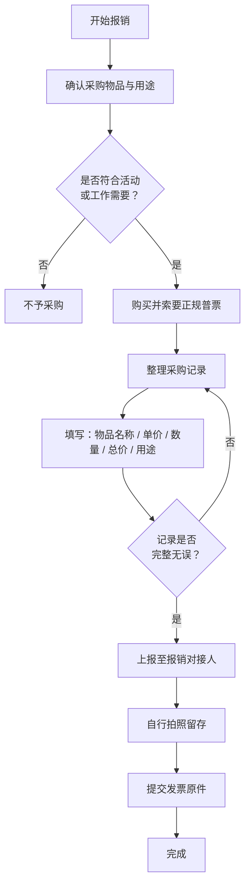

# 报销流程

:::info 维护信息

|                      维护人                      |      时间       |
| :----------------------------------------------: | :-------------: |
| [@Yuna-Celisse](https://github.com/Yuna-Celisse) | 2025.4.25 - Now |

:::

社团为活动或工作采购后，可以把费用报销回来。核心是三件事：开正规**普通发票**、如实记录采购信息、把发票和记录交给当年的**报销对接人**。

## 流程

### 1. 购买前确认

- 确认采购物品与用途符合活动或工作需要。
- 购买时务必索要正规发票，且统一开具**普通发票（普票）**。
- 发票抬头统一填写：**浙大宁波理工学院后勤发展有限公司**。

### 2. 购买后信息记录（必须完整）

购买完成后，立即整理并记录以下信息：

| 物品名称   | 单价（元） | 数量 | 总价（元） | 用途说明 |
| :--------- | ---------: | ---: | ---------: | :------- |
| 示例：网线 |      12.50 |    4 |      50.00 | 机房维护 |

填写要求：

- **单价**：每件物品的价格，必须填写。
- **数量**：购买件数，必须填写。
- **总价**：按“单价 × 数量”计算，必须填写。
- **用途**：写明具体使用场景，避免只写“活动使用”等笼统描述。

### 3. 上报与对接

- 将上述采购记录（含单价、数量、总价、用途）整理后上报给[报销对接人](/concepts/reimbursement-contact)。

### 4. 发票交接

- 信息上报完成后，将**发票原件**交给报销对接人。
- 建议自行拍照留存发票与采购记录，便于后续核对。

## 普票开票信息（统一）

请统一开具普通发票（普票），开票信息如下：

| 项目         | 信息                               |
| :----------- | :--------------------------------- |
| 抬头         | 浙大宁波理工学院后勤发展有限公司   |
| 税号         | 91330212739470000Q                 |
| 地址         | 宁波市鄞州区钱湖南路1号            |
| 电话         | 0574-88229116                      |
| 开户行及账号 | 农业银行天一支行 39056001040002991 |

## 京东开票填写（数电普票）

京东平台请选择：**数电普票**。

填写示例如下：

| 字段         | 填写内容                         |
| :----------- | :------------------------------- |
| 发票抬头     | 单位                             |
| 单位名称     | 浙大宁波理工学院后勤发展有限公司 |
| 纳税人识别号 | 91330212739470000Q               |
| 注册地址     | 宁波市鄞州区钱湖南路1号          |
| 注册电话     | 0574-88229116                    |
| 开户银行     | 农业银行天一支行                 |
| 银行账号     | 39056001040002991                |
