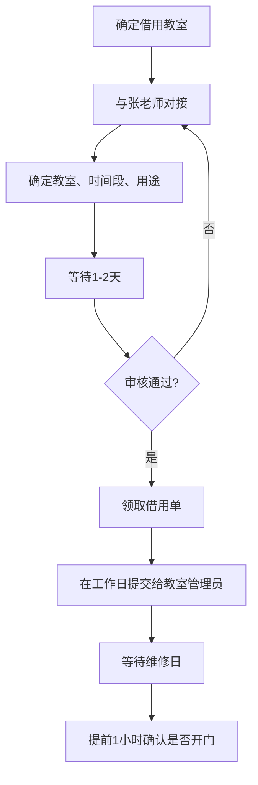
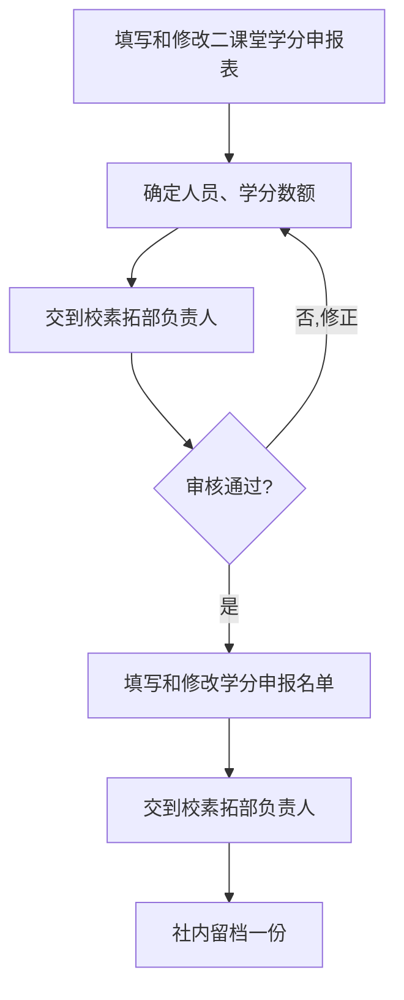

# 借教室

:::info 维护信息 
| 维护人   | 时间      |
| -------- | --------- |
| @qyc1319 | ??? - ??? |
:::

## 流程

# 申请第二课堂学分

:::info 维护信息 
|    维护人     |    时间   |
|   --------    | --------- |
| @ZaoAn0skiler | ??? - ??? |
:::

## 流程

