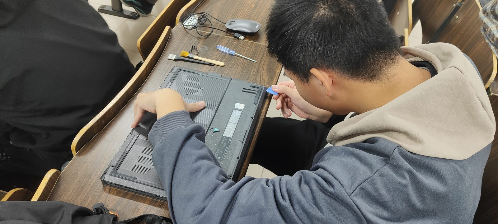
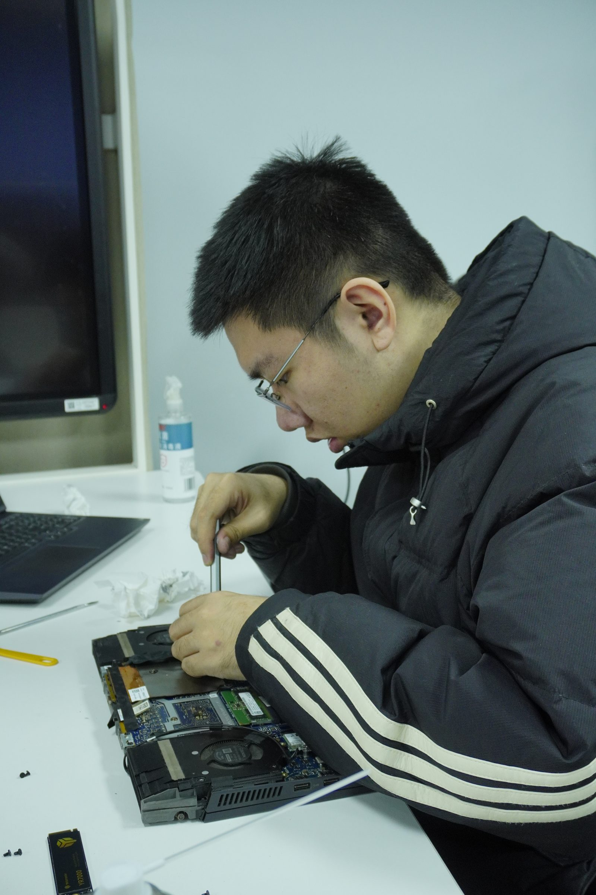

# 维修操作指南

本文是维修队的电脑维修操作指南，涵盖维修前的安全与沟通、通用故障诊断、软件与物理维护、系统重装，以及各厂商笔记本的 BIOS 与恢复入口。基本的电脑维修技能是每一位维修队成员都应掌握的——目标始终是更高效、更安全地为有故障的电脑排障。

## 安全保障

在任何情况下，维修一定是在保障人身、财产以及数据安全的情况下进行。操作者在维修过程中需要保障自身安全，避免被机器划伤、砸伤、触电等危险的发生。对设备进行操作前，必须考虑以下几个问题：

- 我的目的是什么？
- 我接下来该怎么做？
- 怎样减少不必要的步骤？
- 刚才的步骤有没有误？

如果需要重装系统、调整分区大小以及对机器进行物理维护，请务必进行数据备份，避免数据丢失。如果需要物理维护，请小心谨慎。

## 问题确定及其他维修前准备

操作者应提前联系机主，通过文字沟通/图片等形式确定其需求，并制定维护方案。制定完成后请联系机主，告知其维修方案、维修前准备（例如数据备份），以及可能存在的风险。如果有多套方案，可告知其优缺点并让其选择。

## 通用故障诊断

维修的大部分时间花在**定位**而不是修理上。定位的总原则是分层与二分：先判断故障在硬件、固件还是操作系统层，再在该层内用替换与排除把范围收窄。动手时一次只改一个变量，每一步都可回退——否则修好了也不知道是哪一步起效。

### 开机无显示：沿自检链排查

按下电源键后，主板大致按「供电 → CPU → 内存 → 显卡 → 外设」的顺序完成自检（POST），排查也应沿这条链由前向后：

1. **先分清「没开机」还是「没亮屏」**。看电源灯、键盘背光，听风扇与硬盘声：完全无反应指向供电环节（适配器、电池、电源键排线）；有反应但黑屏，则继续向后排查。
2. **排除外设与显示本身**。拔掉所有外接设备（U 盘、扩展坞、移动硬盘）再开机；再外接一台显示器——外接有画面而本机屏幕没有，问题多在屏幕、排线或屏轴，而不在主机。
3. **释放残余电量**。断开适配器（可拆电池的先拆电池），长按电源键 15–30 秒放电后再试。静电或电源管理异常造成的「假死」相当常见。
4. **重插内存**。金手指氧化、接触不良是黑屏最常见的原因之一：断电后取下内存，用橡皮擦拭金手指，多根内存单根轮换插槽逐一测试。
5. **读懂求救信号**。台式机的蜂鸣码、笔记本指示灯的闪烁次数往往编码了自检失败的环节；具体含义随主板与厂商而异，以对应型号的手册为准。

### 存储故障的征兆

- **机械硬盘（HDD）**：规律的「咔哒」声是磁头反复寻道失败的典型征兆——**立即停止通电**，每多开机一次都在扩大数据损失，先抢救数据再谈检测。其他征兆：系统整体卡顿但 CPU 占用不高、文件复制速度骤降、开机反复进入磁盘修复。
- **固态硬盘（SSD）**：故障往往没有机械盘那样的预告，常见形态是突然掉盘（系统中消失）、整盘变为只读，或通电即蓝屏。重要数据只能靠平时备份兜底。
- **用 SMART 判断健康度**：用硬件检测工具（见[软件仓库](./tools)）读取 SMART 属性，重点看 `05`（重映射扇区数）、`C5`（当前待映射扇区数）、`C6`（无法校正扇区数）——任一非零且持续增长，就应按故障盘处理：先备份，再更换。
- **原则：疑似盘故障时，备份优先于检测**。全盘扫描与压力测试都会加速濒死硬盘的恶化。

### 内存故障的征兆

- 蓝屏频繁且**每次错误码不同**，或反复出现 `MEMORY_MANAGEMENT`；
- 应用随机崩溃、解压文件反复校验失败，运行大型程序（游戏、编译）时更易复现；
- 排查靠**排除法**：多根内存单根轮流上机，配合 MemTest86 或 Windows 内存诊断跑完整轮；能稳定复现问题的那根内存（或那个插槽）即嫌疑对象。

### 系统救援的思路

系统起不来时，先分清卡在哪一层，再选对应工具。顺序永远是**先救数据，再修系统**：

1. **还能进系统或安全模式**：先备份数据。安全模式能进而正常模式不能，多为驱动或近期更新所致，逐个回滚最近的变更即可定位。
2. **系统进不去、硬件正常**：从 U 盘启动 [PE 系统](/concepts/winpe)把数据拷出，再处理引导或重装。引导层问题（BCD 丢失、引导分区损坏）可在恢复环境（WinRE 或安装 U 盘）用 `bootrec /rebuildbcd` 等命令修复；修不动时，重装往往比深挖更快、结果更可控。
3. **硬件本身故障**：回到上文的硬件排查。盘已有异响的场景数据抢救优先级最高，不要反复通电试验。

## 软件维护

### 垃圾软件的清理

对于顽固垃圾软件，可以使用 [Geek](/repair/tools) 等工具进行强制删除。对于像“360安全管家”等顽固软件，可以进入 PE 系统直接删除文件，再进入本机操作系统使用 Geek 清理残留文件。

### 蓝屏等故障的排查

根据报错故障代码以及机主蓝屏前的操作（包括但不限于 Windows 更新，硬件驱动更新）来确定问题。造成蓝屏的问题有很多种，具体故障代码可参考 [微软官方文档](https://learn.microsoft.com/)来大致确定问题。

#### 系统文件损坏导致的蓝屏

使用带有 Windows 安装镜像的 U 盘重新安装系统。

#### 硬件问题导致的蓝屏

使用软件测试硬件性能，确定是否为硬件损坏。

## 重新安装 Windows

更完整的从零装机流程，见教程栏的[从零开始安装 Windows](/tutorial/manual/windows-from-scratch)。

### Windows 镜像下载

- [Win10](https://www.microsoft.com/zh-cn/software-download/windows10)
- [Win11](https://www.microsoft.com/zh-cn/software-download/windows11)

下载后打开文件，并选择对其他电脑安装，有两种方法：

1. 直接安装到 U 盘，重启后进入启动菜单或 BIOS，选择 U 盘启动进行安装（选择“我没有密钥”）。
2. U 盘安装 PE 系统，并存 Windows 安装镜像：创建 ISO 文件，完成后将其移动到 U 盘，重启后进入启动菜单或 BIOS，选择 U 盘启动，进入 PE 操作系统，找到 Windows 安装镜像位置并打开 setup 进行安装。

### Windows 11 跳过联网激活步骤

调出 cmd 界面（Shift+F10），输入：

```cmd
oobe\bypassnro
```

[视频教程](https://www.bilibili.com/video/BV1Vd4y1C7dR)（部分机型重装后无网卡驱动，无法联网）。

> 注：较新的 Windows 11 镜像已开始移除 `bypassnro` 命令；若提示命令不存在，需查询当前版本可用的替代方法。

## 物理维护



### 开盖前准备工作

- 确保所有外接设备均已移除，如电源线缆、USB 设备、SD 卡等。
- 确保双手无水滴残留，并进行除静电操作。
- 确保设备处于关机状态，避免维修过程中意外开机。

### 打开后盖

- 使用合适的螺丝刀，避免螺丝滑丝。
- 取下的螺丝需分类暂存，避免丢失。
- 使用尖锐物品小心划开后盖卡扣，避免工具插入过深损坏内部部件。
- 部分较老机型无卡扣设计，可向触控板方向推出后盖。

### 断开（电源）排线

- 视情况使用镊子或手断开电源排线。
- 部分设备有 LED 灯条，需先断开灯条排线再断开电源排线。
- 较老机型电池外置，需在开盖前移除。

## 各类常见物理维护



### 风扇清理

- 轻度积灰：使用刷子配合吸尘器清理。
- 严重积灰：拆卸风扇进行清理。

### 更换硅脂

- 卸下导热管螺丝（按数字降序拆卸，安装时升序）。
- 清理旧硅脂，确保表面无水分残留。
- 涂抹少量硅脂（半颗米大小），均匀涂抹后安装回导热管。

### 更换/加装硬盘

#### M.2 硬盘

- 拆除硬盘末端螺丝，取下硬盘。
- 新硬盘倾斜插入，按压固定并安装螺丝。

#### SATA 2.5寸 硬盘

- 取下硬盘托架，卸下螺丝，换新硬盘后按相反顺序安装。

### 更换/加装内存条

- 拨开两侧金属卡扣，取下旧内存条。
- 确认方向，将新内存条彻底插入，按压至“咔哒”声。

## 维修后恢复机器

- 安装所有排线，合上后盖并施加轻压力确保卡扣扣合。
- 不要立即拧螺丝，先开机测试各项功能，确认正常后再拧紧螺丝。

## 台式电脑的组装和维修

台式机的选件、组装顺序与安装后测试，另见[计算机硬件系统的搭建与维护](/tutorial/manual/hardware-establish)。

[装机教程（bilibili：硬件茶谈）](https://www.bilibili.com/video/BV1Vv411n7x8)

## 各厂商笔记本 BIOS/Boot Manager/一键恢复入口

|      厂商       | BIOS入口                                                                          | Boot Manager入口                                  | 一键恢复入口                                                                 |
| :-------------: | :-------------------------------------------------------------------------------- | :------------------------------------------------ | :--------------------------------------------------------------------------- |
|      联想       | 多数机型开机/重启按F2；ThinkPad部分机型按F1；带Novo键机型关机按Novo键选BIOS Setup | 开机/重启按F12；部分机型需先进BIOS再设置启动项    | 带Novo键机型按Novo键选系统恢复；多数机型开机按F11                            |
|      华硕       | 开机/重启连续按F2；ROG游戏本等机型操作一致                                        | 开机/重启按Esc键调出                              | 开机/重启连续按F9，部分新款支持BIOS内云恢复功能                              |
|      惠普       | 多数机型开机按F10；Pavilion等系列先按Esc调出启动菜单再选BIOS                      | 开机/重启按F9                                     | 开机后连续按F11，直接进入系统恢复界面                                        |
|      戴尔       | 开机/重启连续按F2                                                                 | 开机/重启按F12                                    | 早期机型按Ctrl+F11，新款机型按F8调出高级启动选项再选恢复功能                 |
|      宏碁       | 开机/重启按F2                                                                     | 开机/重启按F12                                    | 开机时按住Alt+F10，进入Acer eRecovery恢复工具                                |
|      华为       | 多数机型开机/重启连续点按F2；二合一机型关机同时按电源键+音量+键                   | 需进入BIOS后设置启动项，或通过F10恢复界面间接调整 | 开机/重启连续点按F10，进入智能还原界面执行恢复出厂设置                       |
|      荣耀       | 开机/重启连续按F2                                                                 | 无专属独立入口，可通过BIOS调整启动顺序            | 开机时长按F10进入系统恢复出厂界面；也可通过荣耀电脑管家触发一键恢复          |
|      小米       | 开机/重启按F2或Delete键                                                           | 需进入BIOS界面中设置启动优先级                    | 部分机型有机身专属恢复键（关机按下启动）；也可通过系统设置路径重置电脑       |
| 苹果（MacBook） | 无传统BIOS，开机按住Command+R进入恢复模式实现部分BIOS功能                         | 开机按住Option键调出启动磁盘选择界面              | 开机按住Command+R进入macOS恢复模式，通过磁盘工具和重装系统实现恢复或出厂重置 |
|      东芝       | 开机/重启按F2                                                                     | 开机/重启按F12                                    | 开机时按数字0（零），启动硬盘恢复工具                                        |
|  索尼（VAIO）   | 开机/重启按F10                                                                    | 无专属快捷键，需进入BIOS设置                      | 开机连续点按F10，启动VAIO Recovery Wizard恢复向导                            |
|     富士通      | 开机/重启按F2                                                                     | 开机/重启按F12                                    | 无专属一键恢复快捷键，需通过预装恢复软件或系统内工具执行恢复                 |

> 注：部分老款机型或特殊系列可能存在按键差异，若快捷键无效，可先关闭电脑快速启动功能后重试，或查询对应机型官方说明书确认。

## 说明

本文档可能存在错误及不足之处，欢迎指正。

:::info 维护信息

| 维护人                                         | 时间             |
| ---------------------------------------------- | ---------------- |
| [@OrangeLee03](https://github.com/OrangeLee03) | 2022.03.13 - Now |

:::
