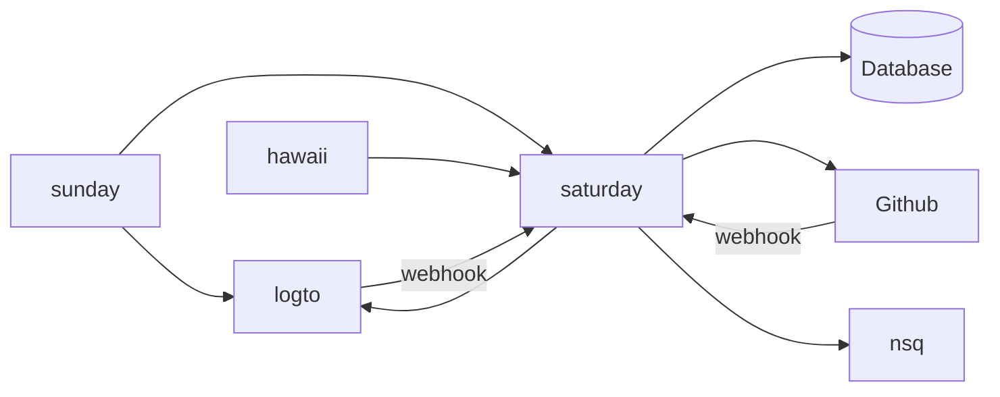
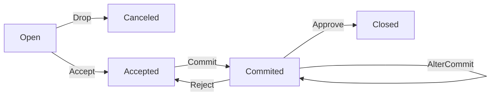
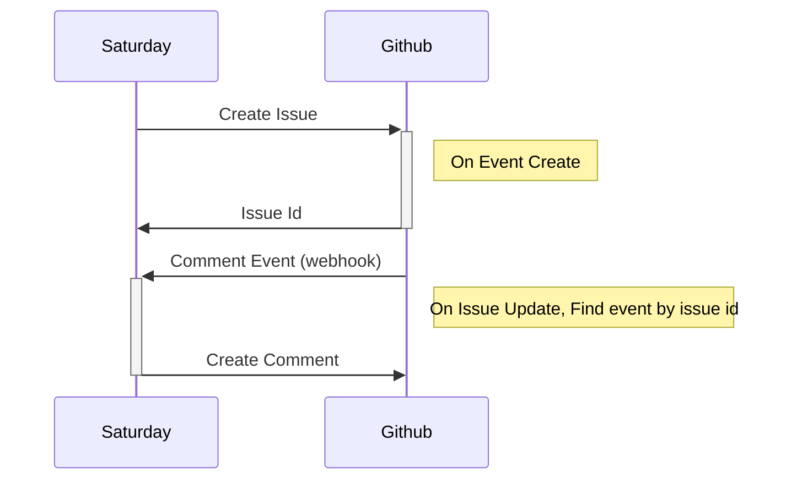
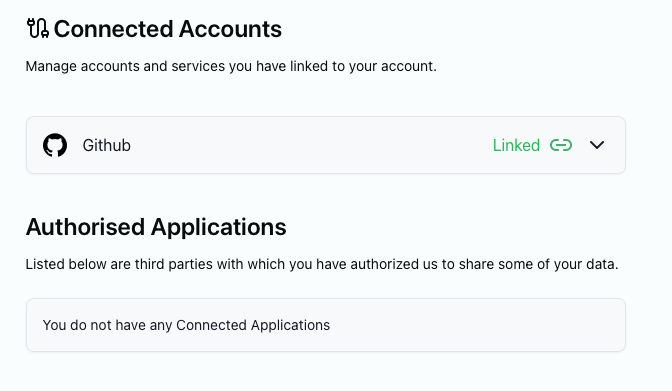
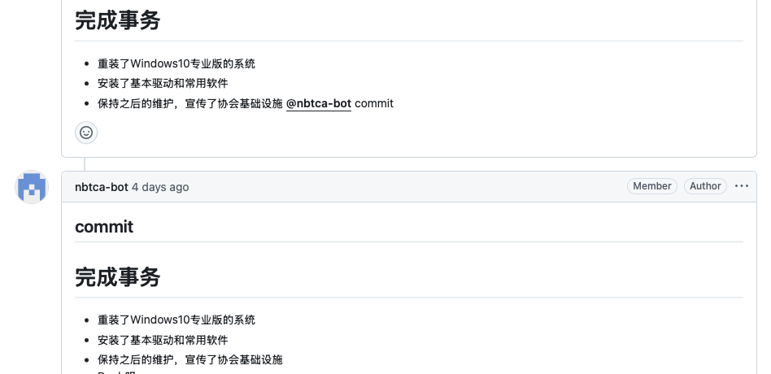

# 维修工单系统 (weekend)

:::info 维护信息

| 维护人        | 时间            |
| ------------- | --------------- |
| @wen-templari | 2025.4.21 - now |

:::

## 总览

| 地址                                 | 仓库                                                | 描述                       |
| ------------------------------------ | --------------------------------------------------- | -------------------------- |
| <https://repair.nbtca.space/api>     | [nbtca/saturday](https://github.com/nbtca/saturday) | 后端                       |
| <https://repair.nbtca.space>         | [nbtca/sunday](https://github.com/nbtca/sunday)     | 管理页面                   |
| NA                                   | [nbtca/hawaii](https://github.com/nbtca/hawaii)     | 微信小程序，用于报修       |
| <https://auth-admin.app.nbtca.space> | [logto-io/logto](https://github.com/logto-io/logto) | 鉴权                       |
| NA                                   | [nsqio/nsq](https://github.com/nsqio/nsq)           | 消息队列，用于推送维修事件 |

## 角色

| 角色名 | 权限描述                             |
| ------ | ------------------------------------ |
| client | 创建维修事件，取消事件               |
| member | 接受维修事件，提交维修描述，放弃事件 |
| admin  | 审核维修描述，关闭事件, 添加member   |

### 维修人员基本信息

为了管理员验证成员身份，以及后续申报志愿者时长，需要收集成员的个人信息。

| 字段名    | 描述     |
| --------- | -------- |
| member_id | 学号     |
| name      | 真实姓名 |
| phone     | 手机号   |
| qq        | QQ号     |

## 维修事件

### 事件状态(status)

| 状态名 | status    | 描述                                 |
| ------ | --------- | ------------------------------------ |
| 待处理 | open      | 维修事件未被成员接受                 |
| 取消   | cancelled | 维修事件被用户取消，不需要再进行处理 |
| 受理   | accepted  | 维修事件已被成员接受                 |
| 待审核 | committed | 成员提交了维修描述，管理员尚未审核   |
| 关闭   | closed    | 维修事件已解决，不能再更改该事件     |

### 事件行为(action)

| 操作名   | action      | 操作权限       | 事件状态变更           | 描述                                         |
| -------- | ----------- | -------------- | ---------------------- | -------------------------------------------- |
| 创建     | create      | client         | nil => open            | 用户创建了维修事件                           |
| 受理     | accept      | member         | open => accepted       | 成员接受了维修事件                           |
| 取消     | cancel      | current client | open => canceled       | 用户取消了自己创建的维修事件                 |
| 放弃     | drop        | current member | accept => open         | 成员放弃了自己接受的维修事件                 |
| 提交     | commit      | current member | accept => committed    | 成员维修完成，添加维修描述后提交给管理员审核 |
| 修改提交 | alterCommit | current member | committed => committed | 成员修改 未被审核的维修提交                  |
| 拒绝提交 | reject      | admin          | committed => accepted  | 管理员拒绝提交                               |
| 关闭     | close       | admin          | committed => closed    | 管理员通过提交                               |

## 在Github上处理维修

目前，新的维修事件会同步到 [Github Issue](https://github.com/nbtca/repair-tickets/issues) 中。成员可以在Github Issue中处理维修事件

### 前提条件

在开始之前，你需要先关联你的Github账户。你可以前往 [MyId](https://myid.app.nbtca.space/account/connections) 关联你的Github账户

### 处理事件

在Github Issue中，你可以通过在回复中包含以下命令来处理事件：

- `@nbtca-bot accept` will accept this ticket
- `@nbtca-bot drop` will drop your previous accept
- `@nbtca-bot commit` will submit this ticket for admin approval
- `@nbtca-bot reject` will send this ticket back to assignee
- `@nbtca-bot close` will close this ticket as completed

