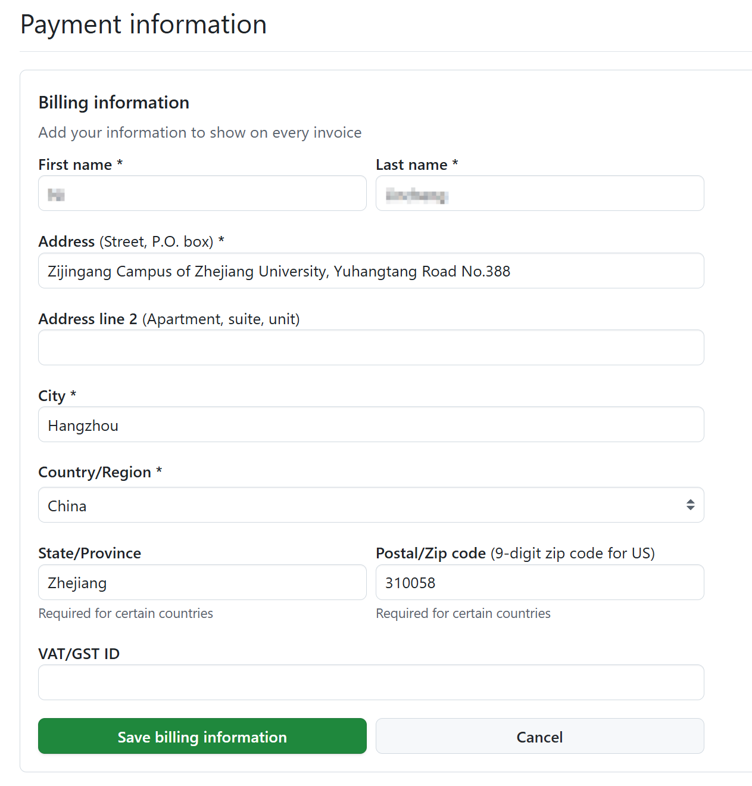

# Github Education 认证指南

:::info 维护信息

|                 维护人                 |       时间       |
| :------------------------------------: | :--------------: |
| [@YunaCelisse](mailto:29951517@qq.com) | 2025.12.26 - now |

:::

## Github Education为我们带来了什么

GitHub Education 围绕学生、教师、学校三类核心用户，提供工具、社区、培训与企业级服务，核心是用行业标准工具与协作流程赋能编程教学与技术社区建设。以下是结构化服务清单：

---

### 一、面向学生的核心服务

| 服务名称 | 核心内容 | 价值亮点 |
| :--- | :--- | :--- |
| 学生开发者包（Student Developer Pack） | 免费GitHub Pro账户、Copilot Pro、Codespaces，以及80+合作厂商的开发工具/云资源/学习内容 | 零成本获取专业级开发工具，快速上手项目与开源协作 |
| GitHub校园专家（Campus Experts） | 社区运营、公开演讲、技术写作等培训，支持在校园搭建技术社区与活动 | 提升软技能，积累社区影响力与职场竞争力 |
| 社区交流平台（Community Exchange） | 发现/协作真实项目，共享代码示例、教程与完整项目 | 获得实战经验，丰富作品集与协作履历 |
| 实习机会（GitHub Intern） | 与GitHub团队协作真实项目，总部实地或远程实习 | 接触行业前沿，积累一线工程经验 |

---

### 二、面向教师的核心服务

| 服务名称 | 核心内容 | 价值亮点 |
| :--- | :--- | :--- |
| GitHub Classroom | 作业创建/分发/提交/自动评分，集成GitHub工作流到课程 | 自动化管理作业与反馈，提升课堂互动与效率 |
| 校园顾问（Campus Advisors） | 线上培训，掌握Git/GitHub教学与实操技能 | 快速将GitHub融入教学，降低技术门槛 |
| 教师工具箱（Teacher Toolbox） | 免费GitHub Team（无限用户/私有库）、Copilot Pro、教学资源 | 低成本搭建课程与科研协作环境 |
| 教育门户与社区 | 集中管理课堂、参与全球教育者讨论、获取教学指南与贴纸等周边 | 连接全球同行，获取最新教学实践与资源 |

---

### 三、面向学校/教育机构的核心服务

| 服务名称 | 核心内容 | 价值亮点 |
| :--- | :--- | :--- |
| GitHub校园计划（Campus Program） | 免费GitHub Enterprise（云/服务器版）、全校级Classroom与技术支持 | 全部门统一使用行业标准工具，支持跨学科协作 |
| 教育许可与折扣 | 标准院校享25% Enterprise席位折扣；Unlimited方案5万美元/年无限席位 | 降低校园技术部署成本，适配不同规模需求 |
| 校园技术生态支持 | 协助部署企业级工具、建立管理员对接机制、促进跨部门协作 | 标准化技术基础设施，提升教学与科研效率 |

---

### 四、通用与附加服务

1. **Copilot Pro免费权限**：学生、教师与开源维护者可免费使用AI代码助手，实时上下文感知建议。
2. **学习路径（Learning Paths）**：分层次的结构化学习指南，覆盖Web开发、数据科学等方向。
3. **全球社区与活动**：教育者讨论区、校园直播（Campus TV）、黑客马拉松与赛事合作。
4. **合作伙伴生态**：80+厂商提供免费工具/云资源/教育内容，覆盖开发全链路。

---

## 获取Github Education认证

### 1.使用教育邮箱注册账户或添加教育邮箱

- 使用教育邮箱注册GitHub账户：使用`.edu`邮箱注册GitHub账户，若此，则不需要再添加教育邮箱
- 添加教育邮箱：打开[GitHub账户设置](https://github.com/settings/emails)，添加`.edu`邮箱，并验证

### 2.在密码和身份验证中添加Two-factor authentication

- 在[密码和身份验证中](https://github.com/settings/security)启用Two-factor authentication
- 在手机上安装Github Mobile App或Microsoft Authenticator扫描QR Code添加账号信息

### 3.在账单信息中添加个人信息

在[账单与付款信息](https://github.com/settings/billing/payment_information)中添加个人信息。此处以`@nit.zju.edu.cn`邮箱为例:

此邮箱对应的学校信息为浙江大学紫金港校区，如为`@nbt.edu.cn`邮箱,对应的是浙大宁波理工学院，请在这些区域如下填写：

- Address: 1 Qianhu South Road, Ningbo Institute of Technology, Zhejiang University ,Ningbo ,Zhejiang Province
- City: Ningbo
- postal code: 315100

### 4.在GitHub Education中申请认证

访问[Education benifits](https://github.com/settings/education/benefits)，点击`Start an application`按钮 
Waring：此处所有操作均不可以在开启代理的情况下进行，并建议在手机浏览器上通过流量进行操作

- 选择类型student ,choose this school ,share your location.
- ID选择0，然后在一张白纸上工整写上以下内容（注意大小写）： 

        Student Verification Report
        Name: Your Name
        School: Your School
        Student Name: Your Student Number
        Study Form: Full-time
        Graduation date: Your Graduation Date

    Attention:以上内容均需与付款信息内的个人信息一致，对于2024级学生，Graduation date为2028.6

- 使用浏览器中的camera上传该内容，注意清晰度且无遮挡
- 等待一段时间后可再次进去该页面查看认证情况，在此期间GitHub会自动审核，审核通过后，即可获得认证，在72h后会发放权限。若审核未通过，会直接发送相关邮件告知原因，请根据邮件修改相关内容，重新提交认证。
