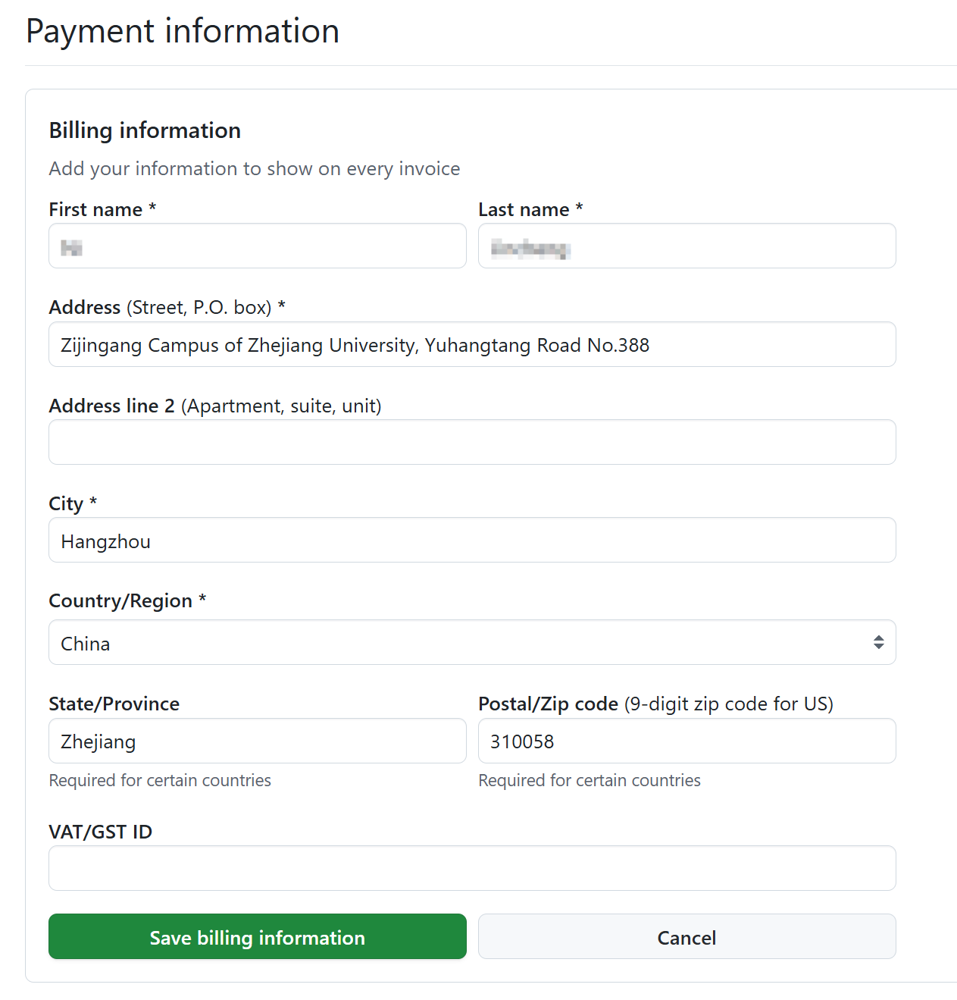

# Github Education 认证指南

GitHub Education 面向在校学生提供 [GitHub Student Developer Pack](https://education.github.com/pack)——免费的 GitHub Pro、Copilot、Codespaces，以及一批合作厂商的开发工具与云资源。用[教育邮箱](/tutorial/2025/edu-email)完成学生身份认证即可领取。本文讲怎么通过这个认证。

## 获取Github Education认证

### 1.使用教育邮箱注册账户或添加教育邮箱

- 使用教育邮箱注册GitHub账户：使用`.edu`邮箱注册GitHub账户，若此，则不需要再添加教育邮箱
- 添加教育邮箱：打开[GitHub账户设置](https://github.com/settings/emails)，添加`.edu`邮箱，并验证

### 2.在密码和身份验证中添加Two-factor authentication

- 在[密码和身份验证中](https://github.com/settings/security)启用Two-factor authentication
- 在手机上安装Github Mobile App或Microsoft Authenticator扫描QR Code添加账号信息

### 3.在账单信息中添加个人信息

在[账单与付款信息](https://github.com/settings/billing/payment_information)中添加个人信息。此处以`@nit.zju.edu.cn`邮箱为例:

此邮箱对应的学校信息为浙江大学紫金港校区，如为`@nbt.edu.cn`邮箱,对应的是浙大宁波理工学院，请在这些区域如下填写：

- Address: 1 Qianhu South Road, Ningbo Institute of Technology, Zhejiang University ,Ningbo ,Zhejiang Province
- City: Ningbo
- postal code: 315100

### 4.在GitHub Education中申请认证

访问[Education benifits](https://github.com/settings/education/benefits)，点击`Start an application`按钮 
Waring：此处所有操作均不可以在开启代理的情况下进行，并建议在手机浏览器上通过流量进行操作

- 选择类型student ,choose this school ,share your location.
- ID选择0，然后在一张白纸上工整写上以下内容（注意大小写）： 

        Student Verification Report
        Name: Your Name
        School: Your School
        Student Name: Your Student Number
        Study Form: Full-time
        Graduation date: Your Graduation Date

  Attention:以上内容均需与付款信息内的个人信息一致，对于2024级学生，Graduation date为2028.6

- 使用浏览器中的camera上传该内容，注意清晰度且无遮挡
- 等待一段时间后可再次进去该页面查看认证情况，在此期间GitHub会自动审核，审核通过后，即可获得认证，在72h后会发放权限。若审核未通过，会直接发送相关邮件告知原因，请根据邮件修改相关内容，重新提交认证。

:::info 维护信息

| 维护人                                           | 时间             |
| ------------------------------------------------ | ---------------- |
| [@Yuna-Celisse](https://github.com/Yuna-Celisse) | 2025.12.26 - Now |

:::
