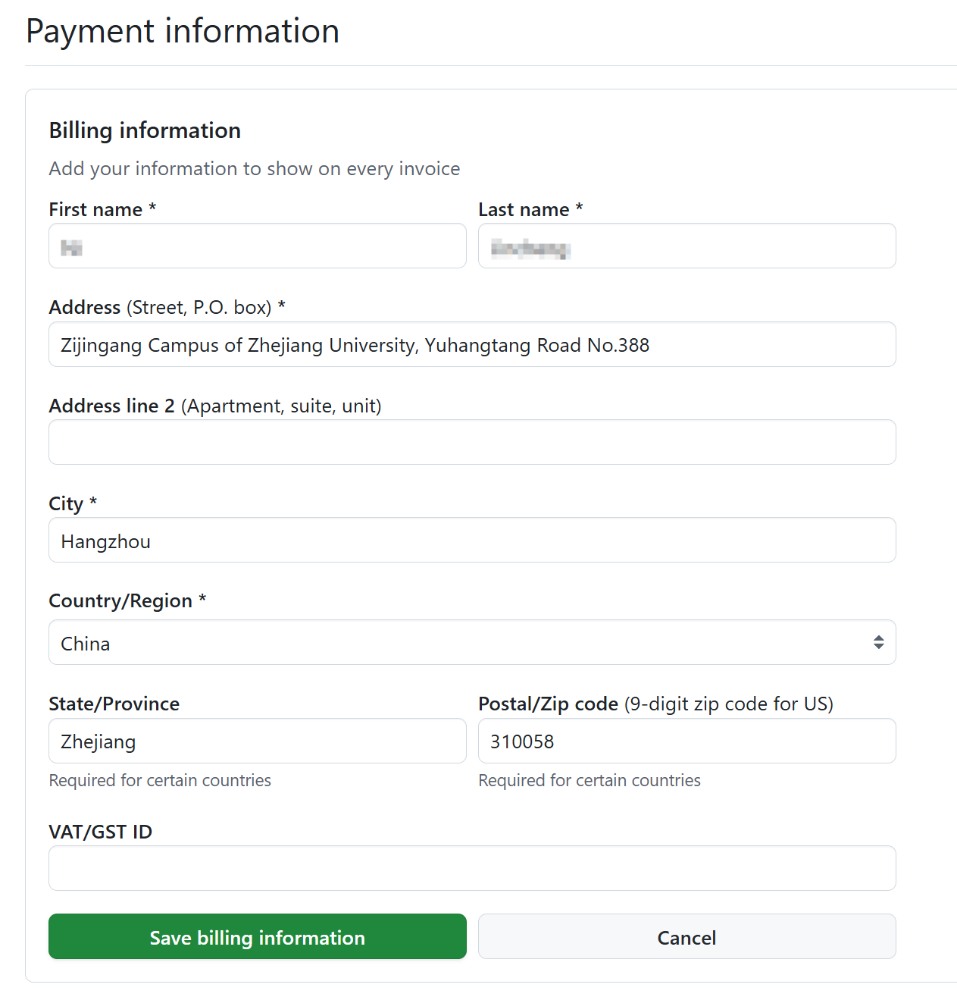

---
maintainers:
  - user: Yuna-Celisse
    since: 2025-12
---

# GitHub Education 认证指南

GitHub Education 面向在校学生提供 [GitHub Student Developer Pack](https://education.github.com/pack)——免费的 GitHub Pro、Copilot、Codespaces，以及一批合作厂商的开发工具与云资源。用[教育邮箱](/tutorial/2025/edu-email)完成学生身份认证即可领取。本文讲怎么通过这个认证。

## 获取 GitHub Education 认证

### 1. 使用教育邮箱注册账户或添加教育邮箱

- 用教育邮箱直接注册 GitHub 账户（这样就不需要再单独添加）
- 已有账户则打开 [GitHub 账户设置](https://github.com/settings/emails)，添加教育邮箱并完成验证

### 2. 开启两步验证（Two-factor authentication）

GitHub Education 要求申请账号已开启两步验证：

- 在[密码和身份验证](https://github.com/settings/security)中启用 Two-factor authentication
- 在手机上安装 GitHub Mobile 或 Microsoft Authenticator，扫描 QR Code 绑定账号

### 3. 在账单信息中添加个人信息

在[账单与付款信息](https://github.com/settings/billing/payment_information)中添加个人信息——审核会拿证明材料与这里的姓名比对，务必如实填写。此处以 `@nit.zju.edu.cn` 邮箱为例：

此邮箱对应的学校信息为浙江大学紫金港校区，如为`@nbt.edu.cn`邮箱,对应的是浙大宁波理工学院，请在这些区域如下填写：

- Address: 1 Qianhu South Road, Ningbo Institute of Technology, Zhejiang University ,Ningbo ,Zhejiang Province
- City: Ningbo
- postal code: 315100

### 4. 在 GitHub Education 中申请认证

访问 [Education benefits](https://github.com/settings/education/benefits)，点击 `Start an application` 按钮。

:::warning 全程不要开代理
GitHub 会用申请时的网络位置核对你是否真的在学校所在地，挂代理会让位置对不上——这是最常见的被拒原因之一。建议在校内网络环境操作，或用手机流量。
:::

- 类型选 `Student`，选择你的学校，按提示共享位置
- **先看你有没有学校开的材料**。GitHub 官方接受的是学校出具的证明：带在读日期的学生证、课表、成绩单，或学籍 / 在读证明信（见 [GitHub 官方说明](https://docs.github.com/en/education/about-github-education/github-education-for-students/apply-to-github-education-as-a-student)）。有这些就直接用，通过率最高。
- 手头没有的时候，社区里流传的做法是在一张白纸上工整写下在读信息再拍照上传（注意大小写）：

  ```text
  Student Verification Report
  Name: Your Name
  School: Your School
  Student Number: Your Student Number
  Study Form: Full-time
  Graduation date: Your Graduation Date
  ```

  〔这个格式不是 GitHub 规定的，是往届同学试出来的写法，能否通过取决于当次审核。〕内容必须是你真实的学籍信息，并与付款信息中的姓名一致——审核会拿两处比对，对不上即拒。对于 2024 级学生，Graduation date 为 2028.6。

- 使用浏览器调起的相机拍摄上传，注意清晰无遮挡。不要上传截图或现成文件：重复的文件容易被判定为重复提交
- 提交后 GitHub 自动审核，可再次进入该页面查看进度；审核多为机器完成，通常几分钟内出结果。通过后 72h 内发放权限；未通过会有邮件告知原因，按邮件调整后重新提交即可

常见的被拒原因：

- 申请时的网络位置与学校对不上（代理没关干净）
- 姓名在证明材料、账单信息两处不一致
- 材料不清晰或缺关键信息（校名、姓名、在读状态、毕业时间）
- 上传的是截图或与此前重复的文件
