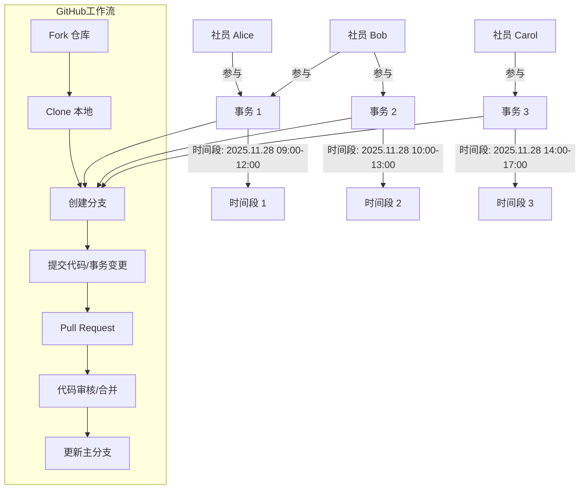
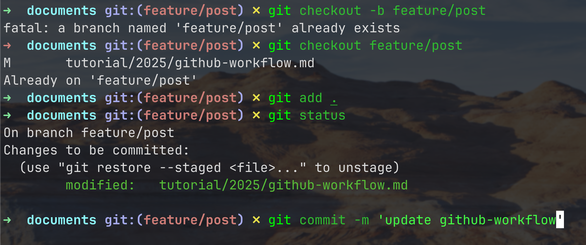
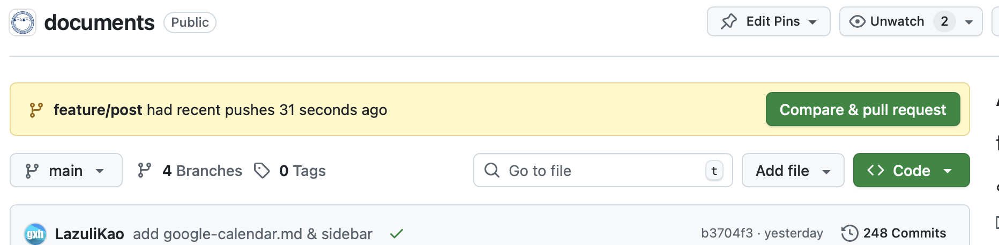
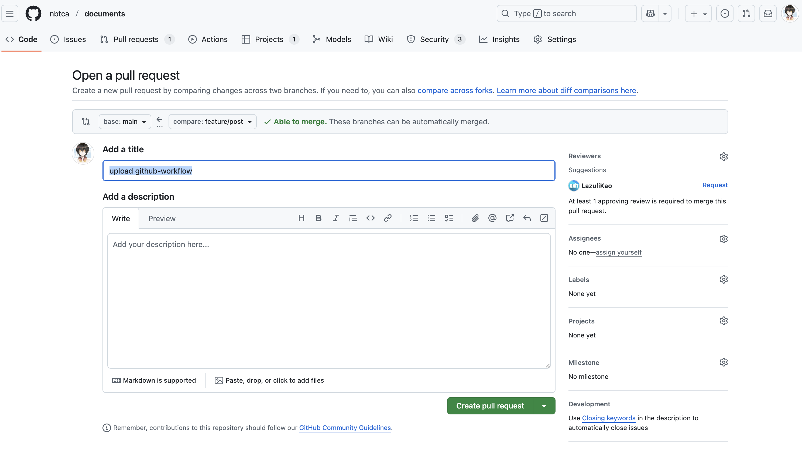
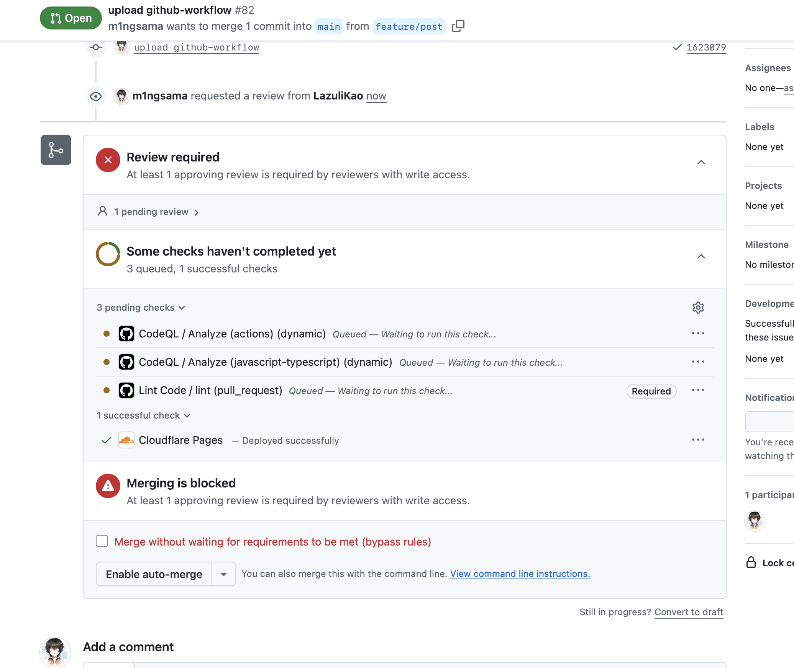

# 快速上手社团目前的Github工作流

:::info 维护信息

|                 维护人                 |       时间       |
| :------------------------------------: | :--------------: |
| [@m1ngsama](mailto:contact@m1ng.space) | 2025.11.18 - now |

:::

## 目前NBTCA社内的常见工作场景

- 多个社员参与同一件事务
- 多个事务在同一个时间段
- 多个时间段事务并行执行

## 那为什么是Github工作流

- 主要还是为了用上[Git](https://git-scm.com)
- 刚好相关事务也关联我们的代码库

## 基本原理

## 一些示范

> 代码库的github流程我就按下不表了，我想感兴趣自己了解会很快

### 检查目前我们正在关注的事务

**_访问[Roadmap](https://github.com/orgs/nbtca/projects/5)_**

**_找个感兴趣的Issue看看_**

**_群贤毕至嗷_**

**_设置个标签方便分类_**

**_订阅通知，会发到邮箱去_**

**_编辑内容支持markdown语法，所以几乎都能写_**

> 什么？不想在浏览器看？

**_那当然也是有的看滴😋_**

**_这个[wiki](https://github.com/nbtca/Minecraft/wiki)好像有点说法，看看怎么个事儿_**

**_看看源码😋_**

**_当然git命令同理_**

**_一派胡言！我来写点😋_**

**_经典丝滑连招_**

**_经验+3，告辞😋_**

---

🎉这样就完成了基本的常见NBTCA事务的Github工作流了

ps:你想更进一步？跟我一起来写手册吧😇

-
-
-
-
-
-
-
-
-
-
-
-
-
-
-
-
-
-
-
-
-
-
-
-
-

## 附加内容

> 恭喜你发现了附加内容XD

**_绝大多数多人协作的代码库都是有分支保护的_**

**_那么在真正的正常提交流程中你一般是在你自己的分支编辑的_**

**_所以你在自己的分支提交到Github后还需要向主分支发起合并请求（Pull Request）_**

**_本次以这个教程文档的提交为例_**

**_编辑此次PR的内容，并选择你希望审查你本次提交的人员（右上角Reviewers）_**

**_你还可以启用Auto-Merge，即在审查通过后自动合并本次源代码提交_**

**_如何Review就请这篇教程的Reviewer来写吧😋_**
