# 快速上手社团目前的Github工作流

:::info 维护信息

|                 维护人                 |       时间       |
| :------------------------------------: | :--------------: |
| [@m1ngsama](mailto:contact@m1ng.space) | 2025.11.18 - now |

:::

## 目前NBTCA社内的常见工作场景

- 多个社员参与同一件事务
- 多个事务在同一个时间段
- 多个时间段事务并行执行

## 那为什么是Github工作流

- 主要还是为了用上[Git](https://git-scm.com)
- 刚好相关事务也关联我们的代码库

## 基本原理

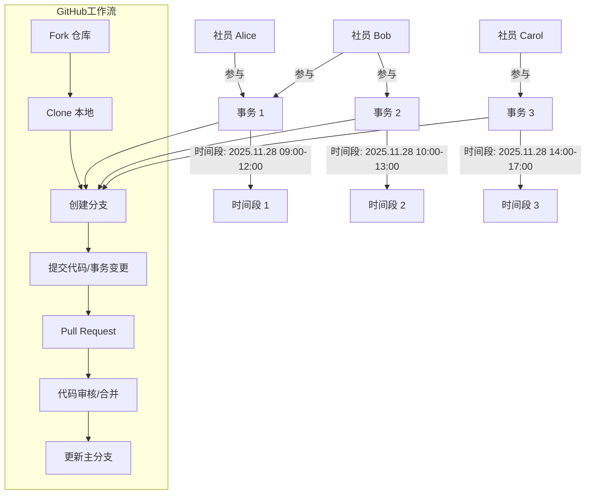

## 一些示范

> 代码库的github流程我就按下不表了，我想感兴趣自己了解会很快

### 检查目前我们正在关注的事务

***访问[Roadmap](https://github.com/orgs/nbtca/projects/5)***

***找个感兴趣的Issue看看***

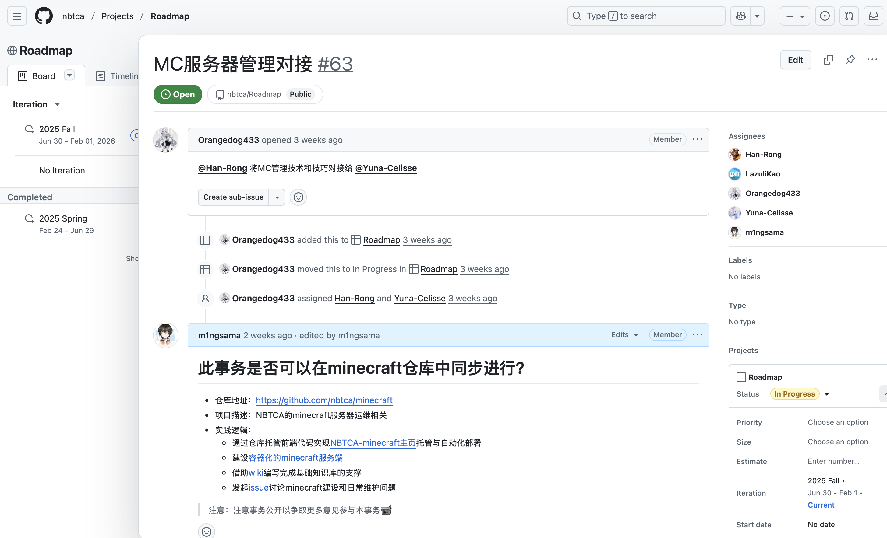

***群贤毕至嗷***

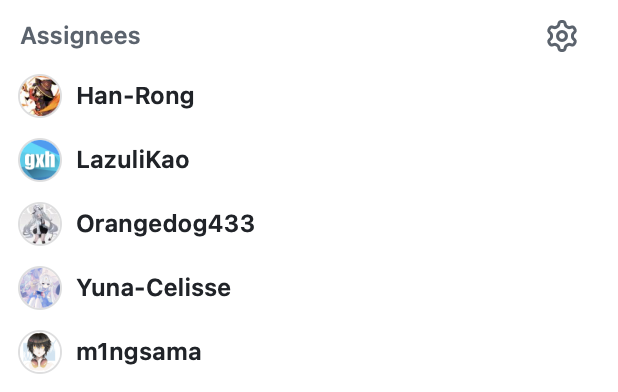

***设置个标签方便分类***

***订阅通知，会发到邮箱去***

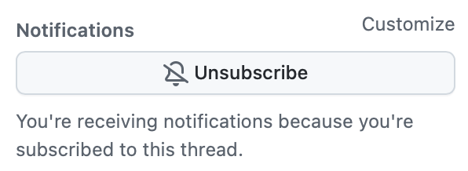

***编辑内容支持markdown语法，所以几乎都能写***

> 什么？不想在浏览器看？

***那当然也是有的看滴😋***

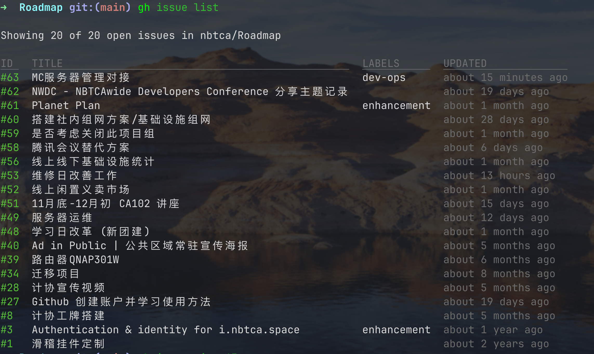

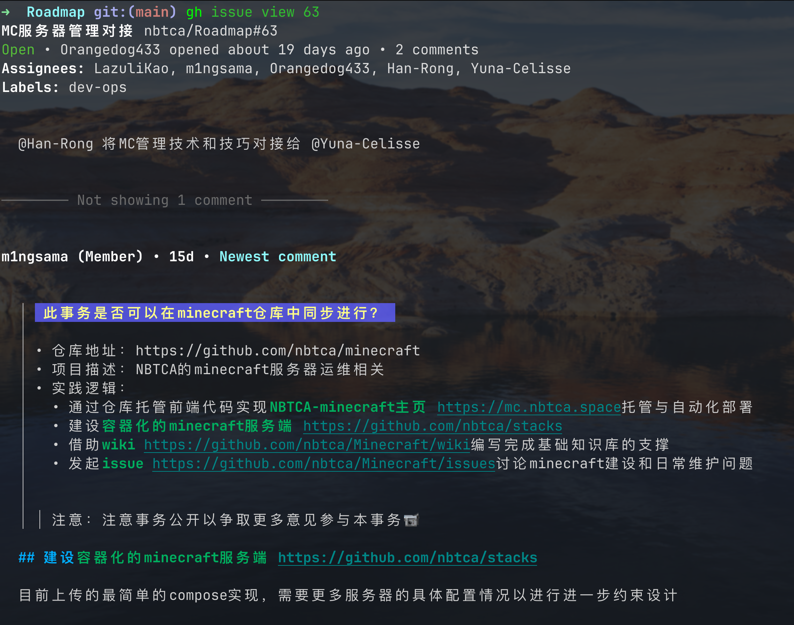

***这个[wiki](https://github.com/nbtca/Minecraft/wiki)好像有点说法，看看怎么个事儿***

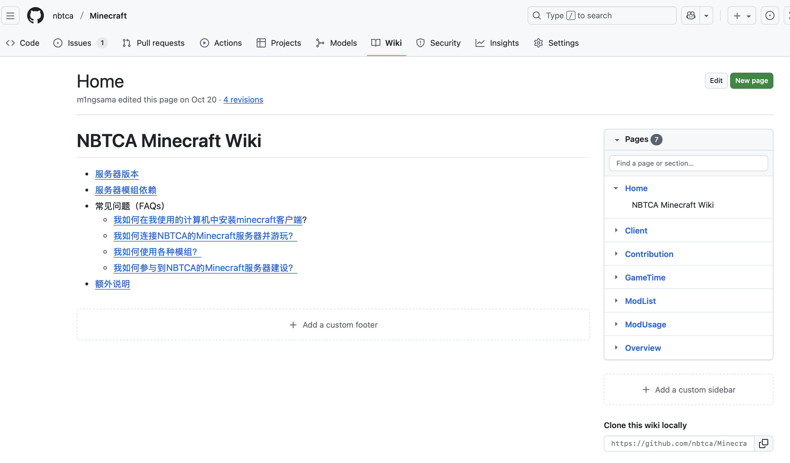

***看看源码😋***

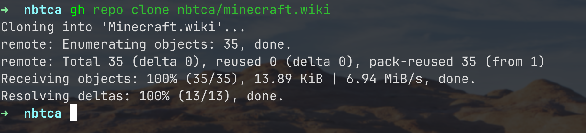
***当然git命令同理***

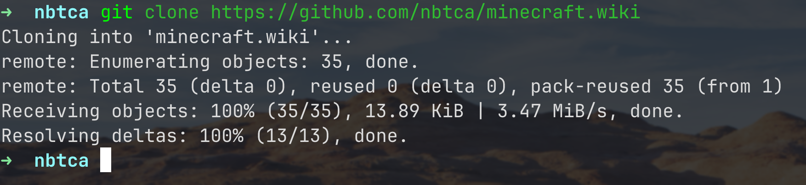

***一派胡言！我来写点😋***

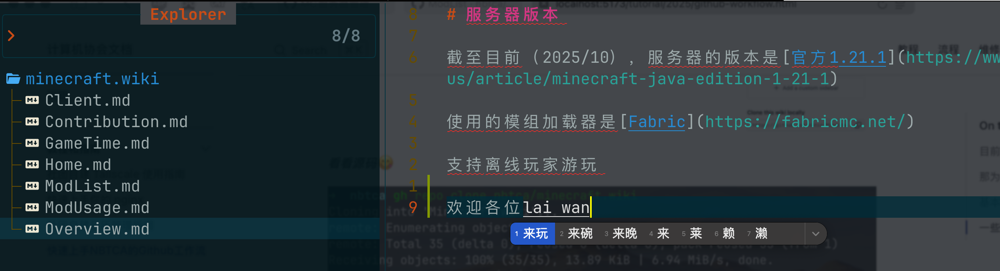

***经典丝滑连招***

***经验+3，告辞😋***

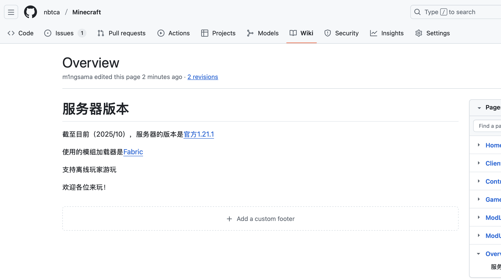

---

🎉这样就完成了基本的常见NBTCA事务的Github工作流了

ps:你想更进一步？跟我一起来写手册吧😇
