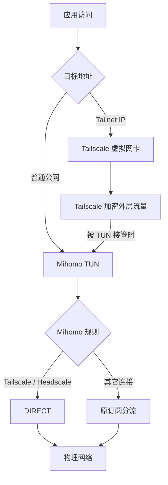

---
maintainers:
  - user: Yuna-Celisse
    since: 2026-09
---

# Windows 下 Mihomo 与 Tailscale 共存教程

开启 Clash Party 的 TUN 后，Tailscale 一直停在 `Starting`；关掉代理就恢复正常——这不一定是两个虚拟网卡无法共存，也可能是控制服务器被解析成了 Fake-IP。

本文根据 2026 年 9 月 4 日的实际排障整理，适用于 **Windows + Clash Party（Mihomo Party）+ Tailscale 客户端 + 社团 Headscale**。最终方案保留 TUN、DNS 覆写和普通网站的 Fake-IP：用 JS 覆写处理路由与直连规则，在 Party 的受控 DNS 配置中让 Headscale 域名返回真实 IP。

首次接入请先完成 [Tailscale 使用指南](/tutorial/2025/tailscale-usage)。本文以未使用 Tailscale 出口节点（exit node）、通过 Tailnet IP 访问设备为前提；子网路由、MagicDNS 和多网卡出口见文末。

## 先分清三种流量

| 流量 | 期望处理方式 | 对应配置 |
| ---- | ----------- | ------- |
| 访问 Tailnet 设备的内层流量 | Windows 路由交给 Tailscale | 排除 Tailnet 网段，保留地址直连兜底规则 |
| Tailscale 连接控制服务器、DERP 和对端的外层流量 | 如果进入 Mihomo，则匹配直连规则 | Headscale 域名、Tailscale 进程规则 |
| 普通公网访问 | 继续按原订阅分流 | 保留原有代理节点与规则 |



**路由排除和 `DIRECT` 是两回事。** 前者使目标网段不被 Mihomo 自动路由接管；后者处理已经进入 Mihomo 的连接。因此，进程规则命中直连，并不等于整个连接从未经过 Mihomo。

这次故障还涉及 DNS：Tailscale 获取 Headscale 控制密钥时，连接到了 `198.18.0.x:443` 并超时。这个地址来自当时的 Fake-IP 配置。排除 Headscale 域名后，解析恢复为真实公网地址，在 Mihomo TUN 保持开启的情况下，Tailscale 也能重新启动。这个结论针对本次故障，不能把所有 `Starting` 都归因于 Fake-IP。

## 第一步：备份并确认配置入口

保留 Clash Party 的 **TUN 模式、规则模式和 DNS 覆写**。先导出或复制已有的 JS 覆写；如果已经有 `main(config)`，将下面的逻辑合并进去，避免同一脚本里出现两个入口。

本次环境的受控配置位于 `%APPDATA%\mihomo-party\mihomo.yaml`。便携版或其它客户端可能不同，应从客户端打开配置目录确认。PowerShell 中可以检查并备份：

```powershell
$partyConfig = Join-Path $env:APPDATA 'mihomo-party\mihomo.yaml'
Test-Path -LiteralPath $partyConfig
$partyBackup = "$partyConfig.$(Get-Date -Format 'yyyyMMdd-HHmmss').bak"
Copy-Item -LiteralPath $partyConfig -Destination $partyBackup
```

如果检查结果为 `False`，先找到当前客户端的实际文件，不要创建一份同名空配置继续操作。`mihomo.yaml` 是本次 Party 的受控设置文件，不等于包含订阅节点、全部规则的最终运行配置。

## 第二步：添加 JS 覆写

在 Clash Party 中新建 JavaScript 覆写，粘贴以下内容，保存并应用到正在使用的订阅。脚本会合并地址排除项，将相关规则放在原规则之前，并清理同类旧规则，重复应用不会累积这些条目。

```javascript
function main(config) {
  const tailnetRanges = ['100.64.0.0/10', 'fd7a:115c:a1e0::/48']
  const tailscaleInterface = 'Tailscale'

  // Preserve existing exclusions and avoid duplicate entries.
  function appendUnique(current, additions) {
    return [...new Set([
      ...(Array.isArray(current) ? current : []),
      ...additions
    ])]
  }

  config.tun = config.tun || {}
  config.tun.enable = true
  config.tun['auto-route'] = true
  config.tun['auto-detect-interface'] = true
  config.tun.stack = config.tun.stack || 'mixed'
  config.tun['route-exclude-address'] = appendUnique(
    config.tun['route-exclude-address'],
    tailnetRanges
  )

  // include-interface and exclude-interface cannot be used together.
  if (config.tun['include-interface']?.length) {
    throw new Error('Remove or reconcile tun.include-interface before applying this override.')
  }
  delete config.tun['include-interface']
  config.tun['exclude-interface'] = appendUnique(
    config.tun['exclude-interface'],
    [tailscaleInterface]
  )

  config.mode = 'rule'
  config['find-process-mode'] = 'strict'

  const rulePrefixes = [
    'DOMAIN,headscale.app.nbtca.space,',
    'PROCESS-NAME,tailscaled.exe,',
    'PROCESS-NAME,tailscale.exe,',
    'PROCESS-NAME,tailscale-ipn.exe,',
    'IP-CIDR,100.64.0.0/10,',
    'IP-CIDR6,fd7a:115c:a1e0::/48,'
  ]
  const tailscaleRules = [
    'DOMAIN,headscale.app.nbtca.space,DIRECT',
    'PROCESS-NAME,tailscaled.exe,DIRECT',
    'PROCESS-NAME,tailscale.exe,DIRECT',
    'PROCESS-NAME,tailscale-ipn.exe,DIRECT',
    'IP-CIDR,100.64.0.0/10,DIRECT,no-resolve',
    'IP-CIDR6,fd7a:115c:a1e0::/48,DIRECT,no-resolve',
  ]

  const originalRules = Array.isArray(config.rules) ? config.rules : []
  config.rules = [
    ...tailscaleRules,
    ...originalRules.filter(rule =>
      typeof rule !== 'string'
      || !rulePrefixes.some(prefix => rule.startsWith(prefix))
    ),
  ]

  return config
}
```

这里的 `DIRECT` 是 Mihomo 的内置直连策略，不需要改成订阅中带图标的代理组名。`strict` 会按规则需要查找进程；如果客户端后续将它覆盖为 `off`，进程规则就无法发挥作用。参见 [Mihomo 全局配置](https://wiki.metacubex.one/config/general/)。

`Tailscale` 应与本机虚拟网卡名称一致，可以用 `Get-NetAdapter` 查看。若已有 `include-interface`，先协调接口限制再使用本脚本；它与 `exclude-interface` 不能同时配置。Windows 下是否成功绕过，应以实际选路为准，不能仅凭存在接口排除项判断。参见 [Mihomo TUN 配置](https://wiki.metacubex.one/config/inbound/tun/)。

## 第三步：在 DNS 覆写中排除 Headscale 域名

本次排障中，**普通 JS 覆写里的 DNS 修改被 Party 后续的受控 DNS 设置覆盖了**。因此只改 JS 不够；需要在客户端 DNS 覆写中修改，并检查保存后的文件与最终运行配置。不同版本的设置入口和覆盖顺序可能变化，以实际生成结果为准。

保持 Fake-IP，使用黑名单过滤模式，并把 `headscale.app.nbtca.space` 加入返回真实 IP 的列表。以下是合并到现有配置中的相关片段，**不要用它覆盖整份文件**，现有 DNS 上游和其它排除域名应继续保留：

```yaml
mode: rule
find-process-mode: strict

tun:
  enable: true
  stack: mixed
  auto-route: true
  auto-detect-interface: true
  route-exclude-address:
    - 100.64.0.0/10
    - fd7a:115c:a1e0::/48
  exclude-interface:
    - Tailscale

dns:
  enable: true
  enhanced-mode: fake-ip
  fake-ip-range: 198.18.0.1/16
  fake-ip-filter-mode: blacklist
  fake-ip-filter:
    - '+.lan'
    - '+.local'
    - 'time.*.com'
    - 'ntp.*.com'
    - '+.market.xiaomi.com'
    - headscale.app.nbtca.space
```

`blacklist` 表示匹配列表的域名返回真实 IP，其它域名仍可使用 Fake-IP。如果原来用的是 `whitelist` 或 `rule` 模式，需要一起调整整份过滤列表，不能只切换模式。参见 [Mihomo DNS 配置](https://wiki.metacubex.one/config/dns/)。

本次最终配置删除了原列表里的单独一项 `'*'`，使用明确的域名条目。不要依赖它代替 Headscale 的精确匹配，也不要把删除这一项单独视作根因修复。

若 UI 保存后没有写入域名，可完全退出 Clash Party，再编辑已备份的受控文件：

```powershell
notepad $partyConfig
```

将上述字段合并到已有的 `tun:`、`dns:` 中，同名字段只保留一份，YAML 缩进使用空格。之后重新启动 Clash Party，确保内核重新加载，并再次检查文件。如果启动或切换订阅后修改消失，需要修正客户端保存的 DNS 覆写来源，反复编辑临时生成文件无法持久生效。

## 第四步：按顺序验证

### 1. 检查实际配置和域名解析

在客户端查看最终运行配置，确认 Tailnet 排除项、置顶规则、`find-process-mode: strict` 以及 Headscale 的 DNS 过滤项都存在。受控文件可以用下面的命令辅助检查：

```powershell
Select-String -Path $partyConfig `
  -Pattern 'fake-ip-filter|headscale.app.nbtca.space|route-exclude-address|find-process-mode' `
  -Context 2,8

Clear-DnsClientCache
Resolve-DnsName headscale.app.nbtca.space -Type A
```

预期得到真实公网地址，可以先出现 CNAME。不要固定判断某一个公网 IP，因为服务器地址可能变更；关键是结果不再落入当前配置的 Fake-IP 地址池，本例为 `198.18.0.0/16`。

若仍返回 Fake-IP，先检查最终 DNS 配置是否覆盖了修改，以及是否还有客户端或内核缓存。只清理 Windows DNS 缓存不会清理所有其它缓存。

### 2. 检查 Tailscale 启动

保持 Mihomo TUN 开启，先运行 `tailscale status`。如果仍停在启动状态，可在管理员 PowerShell 中重启 Tailscale 服务；这会短暂中断当前 Tailscale 连接：

```powershell
Restart-Service Tailscale
tailscale status
```

服务初始化需要时间，稍后再次查看。已有账号应恢复正常状态；若提示需要登录，按 [接入指南](/tutorial/2025/tailscale-usage)完成认证。不要通过退出账号或删除状态文件来代替排障。

### 3. 检查 Tailnet 路由与连接

将下面的示例地址替换为 `tailscale status` 中你自己的在线设备地址，再执行：

```powershell
$peerIP = '100.64.0.10'
Find-NetRoute -RemoteIPAddress $peerIP
tailscale ping $peerIP
ping -n 3 $peerIP
```

预期选中的接口是 Tailscale。`tailscale ping` 可以显示直连或 DERP 路径；先经 DERP、随后建立直连是可能的，始终经 DERP 也不等于共存失败。普通 `ping` 还受操作系统防火墙影响，最终应再打开实际使用的远程桌面、网页或文件服务验证。参见 [Tailscale CLI 文档](https://tailscale.com/docs/reference/tailscale-cli)。

不要拿未分配的 `100.x` 地址测试。排除网段只是让 Mihomo 不接管它，不会凭空创建一条可用的 Tailscale 对端路由。

### 4. 检查普通公网与配置持久化

打开一个原本需要代理的网站，确认原订阅仍正常分流。再重启一次 Clash Party 或重新应用当前订阅，重复 DNS 和 Tailnet 连通性检查，确认修改不会被覆盖。

## 常见问题

### 为什么连接页看不到 Tailscale 地址

访问 Tailnet IP 的内层流量已从 Mihomo 自动路由中排除，可能根本不进入 Mihomo，因此不出现在 Clash Party 连接页是预期现象。

外层控制连接也可能短暂存在，连接页不能作为历史审计。可以结合核心日志中的进程规则命中、`Find-NetRoute` 和 `tailscale ping` 判断。`tailscale ping` 显示直连，证明的是 Tailscale 对端路径；它本身不能证明外层连接命中了哪条 Mihomo 规则。

### 是否还需要绑定 WLAN 的 Tailscale-DIRECT

排障早期曾使用专用 `Tailscale-DIRECT`，将 Tailscale 进程的外层连接绑定到 WLAN。最终基础方案使用内置 `DIRECT`，适合正常单出口环境，也避免换成有线网络后仍绑定失效的 WLAN。

如果确实需要指定物理出口，可以按 [Mihomo DIRECT 文档](https://wiki.metacubex.one/config/proxies/direct/)建立带 `interface-name` 的直连出站，只让外层进程或控制域名规则使用它。**Tailnet 地址兜底规则仍保留内置 `DIRECT`**，不要把发往 Tailnet 的内层包强制送往 WLAN。

### 需要关闭 Tailscale DNS 吗

本次修复不需要关闭 Party 的 DNS 覆写，也不要求统一关闭 Tailscale DNS。Headscale 控制域名的公网解析，与 Tailnet 内部主机名的 MagicDNS 解析是不同问题。

本文先用 Tailnet IP 验证。如果还需要内部主机名，应根据实际 Tailnet / Headscale DNS 后缀另行配置分域解析；不要把 `100.100.100.100` 直接设成所有公网域名的唯一上游，也不要猜测社团的内部后缀。

### 子网路由和出口节点能直接套用吗

子网路由发布的网段可能是 `192.168.x.0/24`，不在本文两个 Tailnet 地址范围内。需要确认路由已批准、客户端接受路由，并将实际远端子网加入排除项；同时检查它与本地局域网是否重叠。

Tailscale 出口节点会参与默认路由，本教程没有覆盖它与 Mihomo 全局 TUN 的协同配置。不要仅添加两个网段后就认为出口节点也已兼容。

### 修改后需要恢复怎么办

禁用新增的 JS 覆写或恢复原脚本，退出 Clash Party，再把第一步保存的备份恢复到原位置。重新打开客户端并清理 Windows DNS 缓存。如果还通过 UI 修改过 DNS / TUN 受控设置，也要恢复对应设置，防止再次覆盖文件。

排障时按“实际配置 → Headscale 真实解析 → Tailscale 状态 → 对端路由和服务”的顺序检查。DNS 已正确但仍无法启动时，继续检查控制服务器可达性、认证和客户端日志；不要继续盲目添加直连规则。
