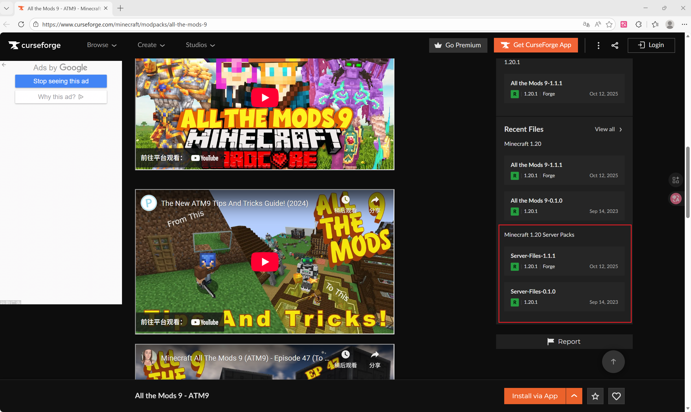
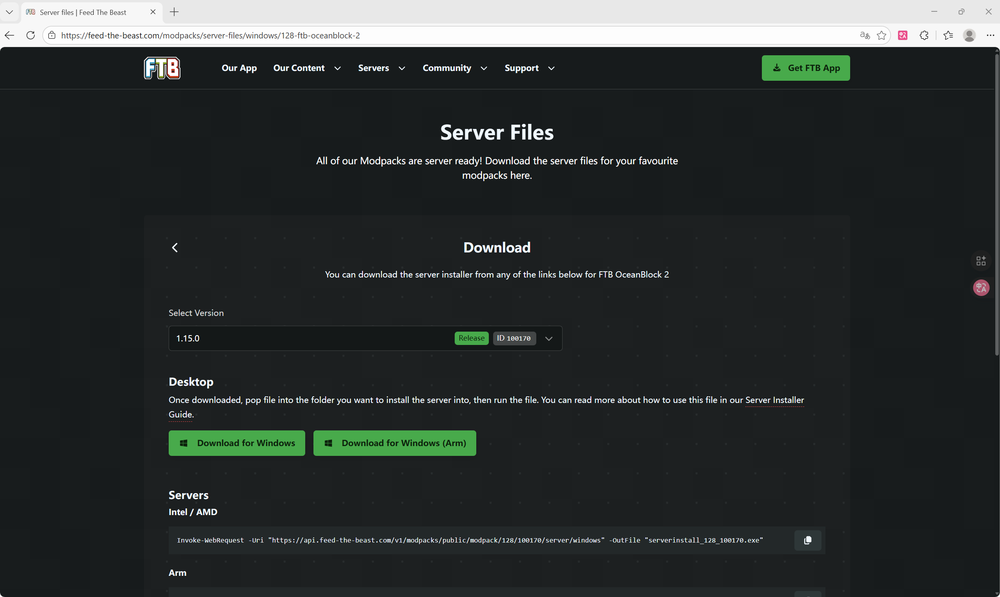
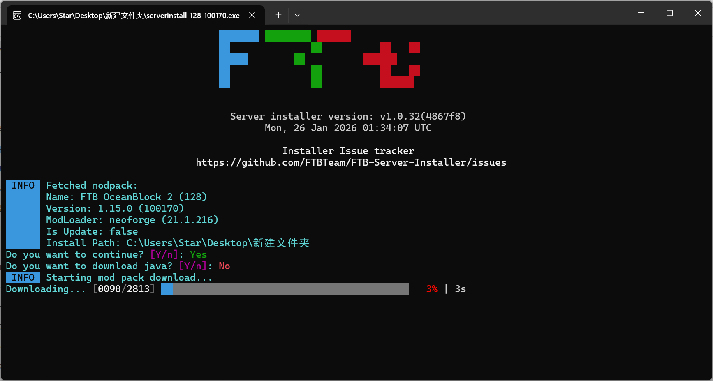

# 搭建属于自己的Minecraft服务器

  |                    维护人                     |       时间       |
  | :-------------------------------------------: | :--------------: |
  | [@YunaCelisse](mailto:29951517@qq.com) | 2026.1.25 - now |

## 前言

一些专有名词的解释:

  | 名词 | 意义 |
  | :-: | :-: |
  | 客户端 | 玩家本地运行的 Minecraft 游戏程序 |
  | 服务端 | 运行在远程主机或本地电脑上的专用程序 |
  | 内网穿透 | 建立公网与内网的定向通信链路 |

在部署属于自己的服务器前,请确保你的部署设备已经安装好了所需运行环境(如对应的Java版本).可以在此处检索你需要的Java版本.本教程由简单至进阶,系统有[Windows](#windows),[Ubuntu](#ubuntu),[MacOS](#macos)和[Docker](#docker),可以根据自身需求选择方案部署.鉴于大部分人部署服务器的需求为开设模组服/插件服或混合端,本教程主要在此方面做介绍.

## 部署服务端(Mod/API or MIX)

### Windows

#### 整合包作者提供了服务端

此处以curseforge平台的ATM9整合包(forge 1.20.1)为例.可以在curseforge下载包括服务器版本的服务端.


游戏包解压后的整个文件夹为服务端的所有文件,运行run.bat可以开始自动化部署.在部署过程中,如遇文件下载失败,请切换至代理网络下载,或请有代理服务的朋友下载好后将游戏包发送给你.

在下载好后,命令行窗口会显示需要同意eula用户协议,然后每过10s尝试启动服务端.此时直接关闭命令行.进入eula.txt将false改为true.然后启动startserver.bat即可成功启动服务端.

还有另一种的部署方式以Feed The Beast团队的的FTB下载器为例.

此处以FTB OceanBlocks 2整合包(neoforge 1.21.1)为例.可以在Feed-The-Beast的官方下载服务端.



将.exe文件移动至部署文件夹中,双击启动.如未安装对应Java,请在第二个选项选择yes.



随后的操作与上面的同理,修改eula文件然后启动服务端.

#### 整合包作者未提供服务端

当整合包作者未提供服务端时,我们需要通过以下步骤完成服务端的自创建.


服务器核心的下载这里推荐[MSL用户中心](https://user.mslmc.net/mc-tools/download-server-core)

- 如仅需部署模组服务器,根据类型选择NeoForge系或Fabric系模组服务端.
- 如仅需使用插件不使用模组,推荐选择插件服务端的paper核心.
- 如需模组和插件共存,推荐使用混合服务端的arclight-*核心.

下载核心至部署位置,在同一目录下创建start.bat文件,内容如下.

```bash
    @echo off
    java -Xms2g -Xmx4g -jar 核心文件名
    pause
```

其中,-Xms为最小分配内存,-Xmx为最大分配内存.将核心文件名带扩展名(.jar)复制进去.

之后的流程与前文的相符,在完成服务端的部署后将整个客户端的文件全部选择复制进服务端即可.

### Ubuntu

首先确保系统已安装所需的Java版本。可以使用以下命令检查Java版本:

```bash
java -version
```

如果未安装或版本不符,可以使用以下命令安装(以OpenJDK 21为例):

```bash
sudo apt update
sudo apt install openjdk-21-jdk
```

下载并解压服务器整合包后,给启动脚本添加执行权限:

```bash
chmod +x run.sh
chmod +x start.sh
```

运行部署脚本:

```bash
./run.sh
```

等待文件下载完成后,需要同意EULA协议。编辑eula.txt文件:

```bash
gedit eula.txt
```

将`eula=false`改为`eula=true`,保存后退出(Ctrl+X, 然后按Y确认)。

最后启动服务器:

```bash
./start.sh
```

<!-- 为了让服务器在终端关闭后继续运行,建议使用screen:

```bash
sudo apt install screen
screen -S minecraft
./start.sh
```

按下`Ctrl+A`然后按`D`即可退出screen会话但保持服务器运行。重新连接使用:

```bash
screen -r minecraft
``` -->

### MacOS

MacOS的部署流程与Linux类似。首先确保已安装Java环境。

推荐使用Homebrew安装Java:

```bash
brew install openjdk@21
```

安装后需要链接Java:

```bash
sudo ln -sfn /opt/homebrew/opt/openjdk@21/libexec/openjdk.jdk /Library/Java/JavaVirtualMachines/openjdk-21.jdk
```

验证安装:

```bash
java -version
```

下载并解压服务器整合包后,打开终端进入服务器目录,给启动脚本添加执行权限:

```bash
chmod +x run.sh
chmod +x start.sh
```

运行部署脚本:

```bash
./run.sh
```

同意EULA协议,编辑eula.txt:

```bash
nano eula.txt
```

将`eula=false`改为`eula=true`,保存退出。

启动服务器:

```bash
./start.sh
```

### Docker

使用Docker部署Minecraft服务器是最便捷和可移植的方案。这里介绍使用[itzg/minecraft-server](https://github.com/itzg/docker-minecraft-server)镜像部署。

#### 前置要求

确保已安装Docker。访问[Docker官网](https://www.docker.com/)下载安装对应平台的Docker Desktop。

#### 部署原版服务器

创建一个目录存放服务器数据:

```bash
mkdir minecraft-server
cd minecraft-server
```

运行Docker容器:

```bash
docker run -d -it -p 25565:25565 \
  --name minecraft-server \
  -e EULA=TRUE \
  -e VERSION=1.20.1 \
  -v $(pwd)/data:/data \
  itzg/minecraft-server
```

#### 部署Forge/Fabric服务器

部署Forge服务器:

```bash
docker run -d -it -p 25565:25565 \
  --name minecraft-forge \
  -e EULA=TRUE \
  -e TYPE=FORGE \
  -e VERSION=1.20.1 \
  -e FORGE_VERSION=47.4.0 \
  -v $(pwd)/data:/data \
  itzg/minecraft-server
```

部署Fabric服务器:

```bash
docker run -d -it -p 25565:25565 \
  --name minecraft-fabric \
  -e EULA=TRUE \
  -e TYPE=FABRIC \
  -e VERSION=1.20.1 \
  -v $(pwd)/data:/data \
  itzg/minecraft-server
```

#### 常用Docker命令

查看容器日志:

```bash
docker logs -f minecraft-server
```

停止服务器:

```bash
docker stop minecraft-server
```

启动服务器:

```bash
docker start minecraft-server
```

进入容器终端:

```bash
docker exec -it minecraft-server rcon-cli
```

删除容器:

```bash
docker rm -f minecraft-server
```

#### 使用Docker Compose

创建`docker-compose.yml`文件:

```yaml
version: '3.8'
services:
  minecraft:
    image: itzg/minecraft-server
    container_name: minecraft-server
    ports:
      - "25565:25565"
    environment:
      EULA: "TRUE"
      VERSION: "1.20.1"
      TYPE: "FORGE"
      FORGE_VERSION: "47.4.0"
      MEMORY: "4G"
    volumes:
      - ./data:/data
    restart: unless-stopped
```

启动服务器:

```bash
docker-compose up -d
```

## 部署后的管理操作

### 隐藏ui窗口

编辑startserver.bat,在启动命令的后段加上 -nogui.这样在启动的时候仅显示命令行窗口而不会有ui窗口,可精简窗口并适当减少系统占用.

## 内网穿透

## 远程服务器方案
